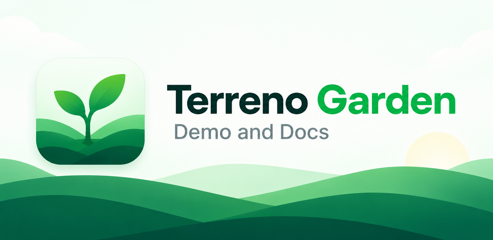

<p align="center">
  
</p>

<h1 align="center">Terreno</h1>

<p align="center">
  <strong>Django/Rails for TypeScript — one codebase for iOS, Android, and web.</strong>
</p>

<p align="center">
  <a href="https://terreno-docs.netlify.app">Docs</a> ·
  <a href="https://terreno-demo.netlify.app">Component demo</a> ·
  <a href="https://terreno-frontend.netlify.app">Example app</a> ·
  <a href="docs/tutorials/getting-started.md">Getting started</a> ·
  <a href="ROADMAP.md">Roadmap</a> ·
  <a href="https://github.com/TerrenoLabs/terreno/discussions">Discussions</a>
</p>

<p align="center">
  <a href="https://dl.circleci.com/status-badge/redirect/circleci/6UHiK7pThPXbhnNi3umQNe/LdjghuhydHjFMyFjcEXMA2/tree/master"></a>
  <a href="https://www.npmjs.com/package/@terreno/api"></a>
  <a href="https://www.npmjs.com/package/@terreno/ui"></a>
  <a href="https://www.npmjs.com/package/@terreno/api"></a>
  <a href="https://codecov.io/gh/TerrenoLabs/terreno"></a>
  <a href="LICENSE"></a>
  <a href="CONTRIBUTING.md"></a>
  <a href="https://github.com/TerrenoLabs/terreno/discussions"></a>
</p>

---

Terreno is Django/Rails for TypeScript — a batteries-included, full-stack
framework where the undifferentiated 80% of an app is already written. On the
backend you get Mongoose models, auto-generated REST APIs, permissions, an admin
panel, authentication, and an AI service. On the frontend you get one universal
app — a single React Native codebase that ships to iOS, Android, and web. It is
built to be driven by AI coding agents from the first prompt to a production
deploy.

- Batteries included — auth, CRUD APIs, admin, permissions, AI, realtime,
  feature flags, and consent are already built, so your code is business logic.
- Universal by default — one React Native codebase ships to iOS, Android, and
  web. Not a web framework with a mobile bolt-on.
- AI-native — agents are a first-class client of the framework, not an
  afterthought.

Terreno's AI-native story has two layers. The tool layer is a Model Context
Protocol (MCP) server that gives coding agents codegen, documentation search,
and component reference for the framework's conventions. The process layer is the
`/terreno-*` SDLC pipeline — plan, implement test-first, verify in a fresh
context, submit with evidence, then own the review loop — which today runs inside
the Terreno repository while its consumer-installable packaging is finished.
Django gives you `manage.py startapp`; Terreno is building a reviewed path from a
request to a mergeable pull request.

Canonical wording, language rules, and an honest Django/Rails comparison live in
[docs/explanation/positioning.md](docs/explanation/positioning.md).

## Quickstart

Start a new app — backend, Expo frontend, auth, and admin already wired up:

```bash
bunx create-terreno-app my-app --display-name "My App"
```

The [getting started tutorial](docs/tutorials/getting-started.md) walks you from
there to a running app in your browser.

### Work on Terreno itself

```bash
git clone https://github.com/TerrenoLabs/terreno.git
cd terreno
bun run bootstrap
```

Then run the example full stack ([getting started](docs/tutorials/getting-started.md)):

```bash
# Terminal 1 — backend
bun run backend:dev

# Terminal 2 — frontend
bun run frontend:web
```

Local development, linking packages, and release steps: [CONTRIBUTING.md](CONTRIBUTING.md).

## Packages

Published together from [`.github/workflows/publish-on-tag.yml`](.github/workflows/publish-on-tag.yml):

- **api/** — REST API framework for Express/Mongoose (modelRouter, auth, OpenAPI) (published as `@terreno/api`)
- **test/** — Shared Bun test helpers, MongoDB preload utilities, and HTTP fixtures (published as `@terreno/test`)
- **ui/** — React Native UI component library for iOS, Android, and web (published as `@terreno/ui`)
- **rtk/** — OpenAPI SDK, Better Auth Redux, and feature flags for Terreno frontends (published as `@terreno/rtk`; **deprecated for collection data sync**)
- **admin-backend/** — Admin panel backend plugin for `@terreno/api` (published as `@terreno/admin-backend`)
- **admin-frontend/** — Admin panel frontend screens for `@terreno/api` backends (published as `@terreno/admin-frontend`)
- **admin-spa/** — Standalone admin SPA (Expo Router web) plus Express serve plugin (published as `@terreno/admin-spa`)
- **ai/** — Provider-agnostic AI service with streaming chat, request logging, and admin tools (published as `@terreno/ai`)
- **api-health/** — Health check plugin for `@terreno/api` (published as `@terreno/api-health`)
- **comms/** — Pluggable mail, SMS, push, and verification providers (published as `@terreno/comms`)
- **feature-flags/** — Feature flags and A/B testing plugin for `@terreno/api` (published as `@terreno/feature-flags`)
- **jobs/** — Durable background jobs plugin for `@terreno/api` (published as `@terreno/jobs`)
- **create-terreno-app/** — Scaffold CLI for a deployable full-stack Terreno app (published as unscoped `create-terreno-app`)
- **mcp-server/** — MCP server that gives coding agents Terreno docs, codegen tools, and prompts (published as `@terreno/mcp`)
- **syncdb/** — Local-first data layer with TinyBase, durable outbox, and delta sync (published as `@terreno/syncdb`)

Workspace apps (not published): **example-backend/**, **example-frontend/**, **demo/**.

## Architecture

```
                           BACKEND
  @terreno/api
  - Mongoose models with modelRouter -> CRUD + sync endpoints
  - Better Auth (default) + legacy JWT/Passport
  - Automatic OpenAPI spec generation
                              |
              +---------------+---------------+
              |                               |
     /openapi.json                    sync protocol
              |                               |
     RTK Query SDK Codegen            @terreno/syncdb
     (non-synced routes)              (collection CRUD)
              |                               |
                           FRONTEND
  @terreno/rtk                         @terreno/syncdb
  - Generated hooks (auth, admin, AI)  - useQuery / useMutate (local-first)
  - Better Auth session Redux          - Offline outbox + conflict UI
  - Feature flags + sockets
                              +
  @terreno/ui
  - React Native components (Box, Button, TextField, etc.)
  - TerrenoProvider for theming
```

New collection CRUD uses `@terreno/syncdb`. Keep `@terreno/rtk` for the generated OpenAPI SDK (non-synced routes), Better Auth session Redux, feature flags, and sockets. Migration: [migrate-rtk-to-syncdb.md](docs/how-to/migrate-rtk-to-syncdb.md).

## Live examples

Public hosted copies of the example apps (not infrastructure you own):

### [Example app](https://terreno-frontend.netlify.app)

<a href="https://terreno-frontend.netlify.app"></a>

A full-stack todo app built on `@terreno/api`, `@terreno/syncdb`, and
`@terreno/ui` — auth, local-first sync, admin, and AI chat. Source:
[example-frontend/](example-frontend/) and [example-backend/](example-backend/).

### [Terreno Garden — component demo](https://terreno-demo.netlify.app)

<a href="https://terreno-demo.netlify.app"></a>

Every `@terreno/ui` component, live, with its variants and states. Source:
[demo/](demo/).

### More

- [Docs](https://terreno-docs.netlify.app)
- MCP server: `https://mcp.terreno.app`

To deploy your own apps, follow [Deploy to GCP](docs/how-to/deploy-to-gcp.md).

## MCP server

Terreno's MCP server is the **tool** layer of the AI-native pillar: codegen, documentation search, and component reference. Pair it with the `/terreno-*` SDLC pipeline described in [positioning.md](docs/explanation/positioning.md) (the **process** layer; consumer packaging is still in progress).

### Cursor

Add this to `.cursor/mcp.json`:

```json
{
  "mcpServers": {
    "terreno": {
      "type": "sse",
      "url": "https://mcp.terreno.app"
    }
  }
}
```

### Claude Code / Claude Desktop

```json
{
  "mcpServers": {
    "terreno": {
      "type": "sse",
      "url": "https://mcp.terreno.app"
    }
  }
}
```

Claude Desktop config paths: macOS `~/Library/Application Support/Claude/claude_desktop_config.json`; Windows `%APPDATA%\Claude\claude_desktop_config.json`.

Restart the assistant after saving.

## Upgrading

`@terreno/*` packages version in lockstep. Fetch notes for your range with the MCP tool `terreno_get_upgrade_guide`, or read `mcp-server/src/docs/upgrades/`. Format: `mcp-server/src/docs/upgrades/README.md`.

If you still call `GET …/feature-flags/evaluate`, migrate using [Add feature flags](docs/how-to/add-feature-flags.md#migrating-from-get-evaluate-openfeature) (also in the 0.30.0 upgrade note).

## Roadmap

Shipped vs planned work is tracked in [ROADMAP.md](ROADMAP.md). Web SSR and
consumer-installable `/terreno-*` packaging are not shipped yet.

## Contributing

See [CONTRIBUTING.md](CONTRIBUTING.md) for setup, tests, and pull request expectations.
Read our [Code of Conduct](CODE_OF_CONDUCT.md) and report security issues via
[SECURITY.md](SECURITY.md) (do not open public issues for vulnerabilities).
Community: [GitHub Discussions](https://github.com/TerrenoLabs/terreno/discussions).

## License

Terreno is [MIT licensed](LICENSE).

<p align="center">
  <a href="https://www.netlify.com"></a>
</p>
