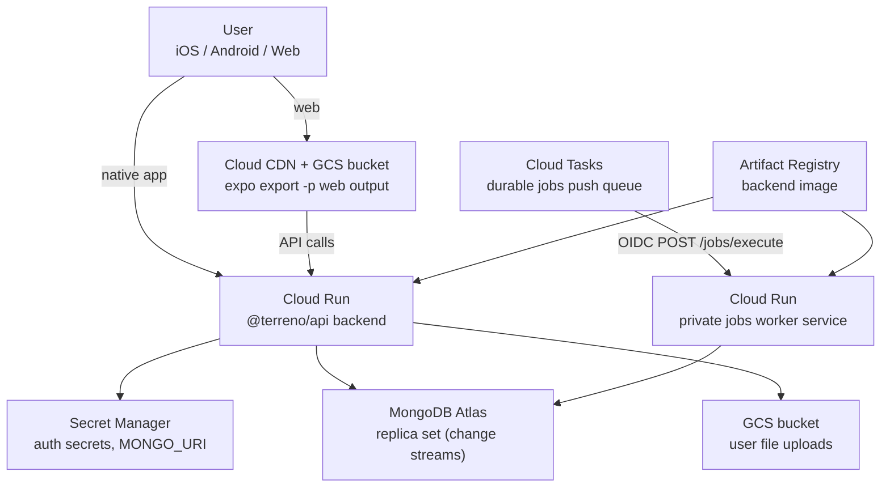

# GCP deployment architecture

Reference topology for hosting a Terreno full-stack app on Google Cloud Platform.

This page is conceptual — commands live in the [how-to guides](../how-to/deploy-to-gcp.md).

## Topology

## Component responsibilities

| Component | Role |
|-----------|------|
| **Artifact Registry** | Stores versioned backend container images built from `example-backend/Dockerfile` |
| **Cloud Run** | Runs the long-lived `@terreno/api` process (HTTP + Socket.io) |
| **Cloud Tasks** | Provisioned push queue for `@terreno/jobs`; unused until the API selects `GcpCloudTasksRunner` |
| **Jobs worker service** | Private Cloud Run service running the example-backend image; IAM-restricted to the Cloud Tasks invoker SA |
| **Secret Manager** | Holds `MONGO_URI`, JWT secrets, and other credentials — mounted as env vars |
| **MongoDB Atlas** | Primary database; must be a replica set for change streams (realtime, feature flags) |
| **GCS (web bucket)** | Serves static web export; CDN caches at the edge |
| **GCS (uploads bucket)** | Private object storage for user uploads via `@terreno/api` file plugins |

## Why Cloud Run (not App Engine or GKE)

| Option | Tradeoff |
|--------|----------|
| **Cloud Run** | Pay-per-use, minimal ops, supports WebSockets with session affinity — fits Terreno's socket + HTTP model |
| **App Engine** | Similar serverless model but less flexible for custom containers and long timeouts |
| **GKE** | Full control but requires cluster management — overkill for a single Terreno backend |

## Why Atlas (not self-hosted Mongo on GCP)

| Option | Tradeoff |
|--------|----------|
| **MongoDB Atlas** | Managed replica sets, backups, and change streams out of the box |
| **Self-hosted on Compute Engine** | You operate replica set elections, backups, and upgrades — documented as out of scope for launch |

## Static web vs server-rendered

| Approach | Tradeoff |
|----------|----------|
| **GCS + CDN (static export)** | Cheapest, simplest, works today with Expo `single`/`static` output — no SSR or API routes |
| **Node/Bun server (SSR)** | Better SEO and API routes — requires Expo SDK ≥ 55; not available in the current `~54` catalog |

Native iOS and Android apps call Cloud Run directly; only the web client uses the CDN origin.

## Durable jobs worker infrastructure

Cloud Tasks is a push service; it does not expose a pull-consumer API. Cloud Run worker
pools do not have HTTP ingress, so Infra Manager provisions a private Cloud Run service
as the future execution pool. Queue rate limits bound dispatch concurrency and Cloud Run
scales the worker instances.

The example API still runs `@terreno/jobs` with `MongoJobRunner` until a follow-up
selects `GcpCloudTasksRunner`. Production and PR revisions already share matching
`pr-<number>` tags and `terreno-example-pr-<number>` databases so that follow-up can
enqueue to isolated callback URLs without colliding.

## Related

- [Deployment baseline](deployment-baseline.md) — seven requirements every host must satisfy
- [Deploy to GCP](../how-to/deploy-to-gcp.md) — step-by-step guides
