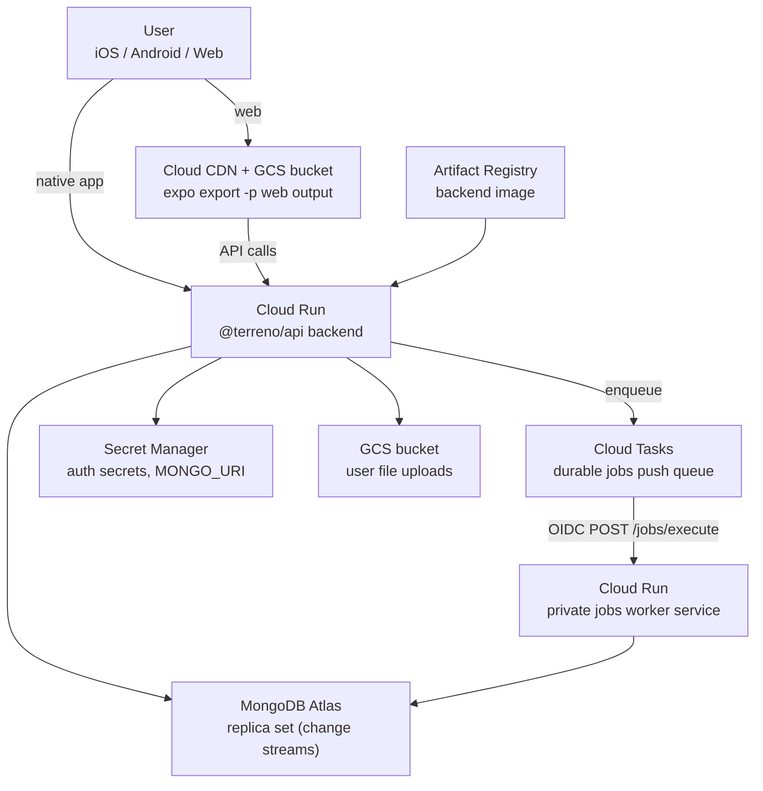

# GCP deployment architecture

Reference topology for hosting a Terreno full-stack app on Google Cloud Platform.

This page is conceptual — commands live in the [how-to guides](../how-to/deploy-to-gcp.md).

## Topology

## Component responsibilities

| Component | Role |
|-----------|------|
| **Artifact Registry** | Stores versioned backend container images built from `example-backend/Dockerfile` |
| **Cloud Run** | Runs the long-lived `@terreno/api` process (HTTP + Socket.io) |
| **Cloud Tasks** | Dispatches persisted `@terreno/jobs` rows to an authenticated HTTP worker with queue-level concurrency limits |
| **Jobs worker service** | Runs the same example-backend image and job definitions; exposes only the Cloud Tasks execute callback through Cloud Run IAM |
| **Secret Manager** | Holds `MONGO_URI`, JWT secrets, and other credentials — mounted as env vars |
| **MongoDB Atlas** | Primary database; must be a replica set for change streams (realtime, feature flags) |
| **GCS (web bucket)** | Serves static web export; CDN caches at the edge |
| **GCS (uploads bucket)** | Private object storage for user uploads via `@terreno/api` file plugins |

## Why Cloud Run (not App Engine or GKE)

| Option | Tradeoff |
|--------|----------|
| **Cloud Run** | Pay-per-use, minimal ops, supports WebSockets with session affinity — fits Terreno's socket + HTTP model |
| **App Engine** | Similar serverless model but less flexible for custom containers and long timeouts |
| **GKE** | Full control but requires cluster management — overkill for a single Terreno backend |

## Why Atlas (not self-hosted Mongo on GCP)

| Option | Tradeoff |
|--------|----------|
| **MongoDB Atlas** | Managed replica sets, backups, and change streams out of the box |
| **Self-hosted on Compute Engine** | You operate replica set elections, backups, and upgrades — documented as out of scope for launch |

## Static web vs server-rendered

| Approach | Tradeoff |
|----------|----------|
| **GCS + CDN (static export)** | Cheapest, simplest, works today with Expo `single`/`static` output — no SSR or API routes |
| **Node/Bun server (SSR)** | Better SEO and API routes — requires Expo SDK ≥ 55; not available in the current `~54` catalog |

Native iOS and Android apps call Cloud Run directly; only the web client uses the CDN origin.

## Durable jobs and PR isolation

Cloud Tasks is a push service; it does not expose a pull-consumer API. Cloud Run worker
pools do not have HTTP ingress, so the example uses a private Cloud Run service as the
execution pool. Queue rate limits bound dispatch concurrency and Cloud Run scales the
worker instances.

Production and PR revisions share one queue safely because every task stores its complete
callback URL. A PR backend targets the matching `pr-<number>` worker tag and uses
`terreno-example-pr-<number>` as its Mongo database. Removing a preview removes both
service tags. An old callback then fails closed instead of reaching production or another
PR. A failed backend preview tag cannot stay on a not-Ready revision: CD rebuilds traffic
from Ready tags, deploys the new revision without `--tag`, then tags it.

Queue IAM grants `cloudtasks.enqueuer` and `iam.serviceAccountUser` on
`terreno-jobs-invoker` only to `terreno-backend-runtime`, the example API Cloud Run
identity. The project default Compute Engine SA (MCP and any other service that omits a
runtime identity) cannot create tasks that present that OIDC token. The worker remains
invokable only by `terreno-jobs-invoker`.

## Related

- [Deployment baseline](deployment-baseline.md) — seven requirements every host must satisfy
- [Deploy to GCP](../how-to/deploy-to-gcp.md) — step-by-step guides
