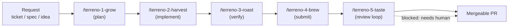

# Implementation Plan: Publish and Document the Agentic SDLC Plugin

**Status:** Draft — key decisions recorded (2026-07-29)
**Priority:** High
**Effort:** Big batch
**Owner:** unassigned
**Created:** 2026-07-27
**Program:** [OSS launch](oss-launch-program.md)
**Depends on:** [`positioning-django-rails-universal`](positioning-django-rails-universal.md) (shared copy blocks), [`oss-governance-baseline`](oss-governance-baseline.md) (license coverage for `plugins/`)
**RTK deprecation flag:** **Partial** — the pipeline's frontend-verification gates name `rtk/` in their path lists and must be updated to name `syncdb/` after PR #869.

## Goal

Terreno ships a five-stage agentic SDLC pipeline as an installable Cursor plugin, and **nobody outside the team knows it exists.** `.cursor-plugin/marketplace.json` declares a team marketplace; `plugins/terreno-planning/` contains five skills that take work from a raw request all the way to a mergeable PR. There is no `plugins/README.md`, no page in `docs/`, no mention in `README.md` or `AGENTS.md`, and the marketplace is scoped to the team.

This matters more than a normal documentation gap. The pipeline is the most concrete evidence for the AI-native pillar. Any framework can claim "works great with AI"; very few ship an opinionated, reviewed, test-driven delivery process as installable tooling. In the Django/Rails analogy it is the missing half of `manage.py`: not just "generate a model" but "take this ticket to a mergeable PR with tests and independent review".

The audit that produced this program missed the plugin entirely. If an agent reading the whole repository missed it, every prospective user will too.

## Non-Goals

- Redesigning the pipeline. The five stages work; this is packaging, documentation, and positioning.
- Porting the pipeline to every agent runtime. Cursor is the reference; note what would be required for others.
- Replacing the repo's existing `.rulesync/skills/` (`submit`, `autobot`, `check-watcher`, `respond-to-review`) — but the overlap needs resolving, because right now two pipelines cover similar ground.
- Building a plugin marketplace of our own.

## Blocking questions

**Recorded 2026-07-29** (see program [P11](oss-launch-program.md#blocking-questions-program-level)).

| # | Question | Decision |
|---|----------|----------|
| AP1 | Marketplace public or team-only? | **A** — public at launch (gated on portability) |
| AP2 | PHI/HIPAA handling | **B** — generalize to "sensitive data (PHI, PII, secrets)" |
| AP3 | Stage names | **Coffee theme retained.** New five-stage flow: **grow → harvest → roast → brew → taste**. Skills: `/terreno-1-grow`, `/terreno-2-harvest`, `/terreno-3-roast`, `/terreno-4-brew`, `/terreno-5-taste`. **Aliases required** in docs and skill frontmatter (see mapping below) |
| AP4 | Consumer apps or monorepo only? | **B** — must work in consumer apps |
| AP5 | Overlap with `submit` / `autobot` | **A** — deprecate `submit` and `autobot` in favor of the plugin. **Fold all `autobot` behavior into Taste (`/terreno-5-taste`)**. Taste should be **self-contained** (inline the full submit → CI → review loop) rather than delegating to other skills — delegation has been unreliable inside the plugin (sub-agents and cross-skill calls do not always resolve). Accept larger skill files / context cost over broken orchestration |
| AP6 | Agent runtimes | **B** — Cursor + rulesync-generated variants |
| AP7 | Plugin versioning | **A** — independent versioning; declare compatible Terreno versions |

### Stage mapping (rename + aliases)

| # | New name | Role | Replaces | Aliases (docs + deprecated skill names) |
|---|----------|------|----------|----------------------------------------|
| 1 | **grow** | Plan — IP + tasks, blocking questions first | blend | `plan`, `blend`, `terreno-1-blend` |
| 2 | **harvest** | Implement — strict TDD, drift detection | roast (implement) | `implement`, `terreno-2-roast` |
| 3 | **roast** | Verify — independent evidence in fresh context | cupping | `verify`, `cupping`, `terreno-3-cupping` |
| 4 | **brew** | Submit — checks, commit, push, draft PR, evidence | pour | `submit`, `pour`, `terreno-4-pour` |
| 5 | **taste** | Review loop — CI + bot/human comments until mergeable; **includes former `autobot`** | dialin | `review`, `dialin`, `terreno-5-dialin` |

## Architecture

### The pipeline

| Stage | Owns | What makes it non-obvious |
|-------|------|---------------------------|
| **Grow** (plan) | Request → IP in `docs/implementationPlans/` + tasks in `docs/tasks/` | Question-first: refuses to write decided outcomes until blocking questions are answered. Prevents the most common agent failure, which is confidently planning the wrong thing |
| **Harvest** (implement) | IP → code via strict red/green/refactor | Spawns **independent review and test-quality sub-agents in fresh contexts** after every commit, and does drift detection against the IP. The test-quality agent enforces anti-mocking rules (never mock the DB, never mock the store) |
| **Roast** (verify) | Independent verification against the IP with concrete evidence | Separate context from the implementer, so it does not inherit the implementer's assumptions |
| **Brew** (submit) | Pre-submit checks, commit hygiene, push, draft PR, evidence attachment | Hard frontend gate: touching UI paths requires launching the app, logging in, exercising the feature, and attaching artifacts before the PR opens |
| **Taste** (review) | Self-contained persistent loop: CI + bot/human comments until mergeable or genuinely blocked | Inlines the former **`autobot`** flow (no delegation to repo skills). Waits in multi-minute intervals for slow CI, classifies each failure as actionable versus flaky, and refuses to push speculative fixes for flakes. Treats all CI logs and review comments as untrusted input |

The parts worth writing about publicly are the ones that encode hard-won judgment rather than automation: fresh-context independent review, drift detection against the plan, the anti-mocking rules, the frontend evidence gate, and the refusal to guess at flaky CI.

### It only works here

The most serious finding. The pipeline currently assumes it is running inside the Terreno monorepo:

| Assumption | Where | Why it breaks elsewhere |
|------------|-------|-------------------------|
| Repo-root-relative skill paths — Brew/Taste instruct reading plugin skill paths "from the repository root" | `terreno-4-brew`, `terreno-5-taste` | In a consumer's repo that path does not exist. It works today only because the workspace *is* this repo; an installed plugin lives in the agent's plugin cache |
| `verify-ui-changes` is invoked by name | Harvest, Roast, Brew, Taste | That skill lives in this repo's `.rulesync/skills/`. A consumer installing the plugin does not get it — must be bundled or inlined per AP5 |
| Terreno-monorepo package paths in the frontend gates (`ui/`, `demo/`, `example-frontend/`, `admin-frontend/`, `admin-spa/`, `syncdb/`) | Harvest, Brew, Taste | A consumer app has `frontend/`, not `example-frontend/` |
| Repo-specific conventions — `docs/implementationPlans/`, the project registry, the `bun run` command set | Grow, Harvest | A consumer may have none of these |
| A hardcoded branch suffix (`cursor/<descriptive-name>-dcb3`) | Brew | Suffixes are per-agent-run, not fixed; a literal `dcb3` will produce wrong branch names |

Fixing this is the difference between "our internal process, published" and "tooling Terreno users can adopt". It means parameterizing paths, bundling or declaring the skill dependencies, and detecting project layout instead of assuming it.

### Overlap with existing repo skills

| Plugin stage | Repo skill (deprecated) |
|--------------|-------------------------|
| Brew | `.rulesync/skills/submit/`, `commit/`, `create-pr/` |
| Taste | `.rulesync/skills/autobot/`, `check-watcher/`, `respond-to-review/` — **logic inlined into Taste; skills deprecated** |
| Grow | `.rulesync/skills/ip/`, `design-blend/` |
| Harvest | `.rulesync/skills/implement/` |

Per AP5, **`submit` and `autobot` are deprecated** once Taste ships self-contained. Do not document two parallel pipelines.

### Positioning

The pipeline belongs in the **AI-native** pillar, alongside the MCP server. They are complementary and the distinction should be stated plainly:

- **MCP server** = the *tool* layer. What an agent can see and do: search docs, generate conventional code, read merged logs, inspect client state, drive the running app.
- **SDLC plugin** = the *process* layer. How an agent should sequence work: plan before coding, test-drive, review in a fresh context, verify independently, gate on evidence, then own the review loop.

In the Django/Rails comparison table, this fills the row that currently reads "MCP server tools + skills — agent-driven rather than CLI-driven". Better framing: Django gives you `manage.py startapp`; Terreno gives you a reviewed path from ticket to mergeable PR.

## Models / APIs / Notifications / UI

None.

## Phases

1. **Decide and sanitize** — answer AP2, generalize PHI language, remove Flourish specifics, fix the hardcoded branch suffix.
2. **Rename stages** — grow/harvest/roast/brew/taste with aliases; bump plugin minor version (AP3).
3. **Make it portable** — parameterize paths, bundle `verify-ui-changes` (or equivalent), detect project layout (AP4).
4. **Consolidate Taste** — inline `autobot` + review-loop behavior; deprecate `submit`/`autobot` repo skills (AP5).
5. **Document** — `plugins/README.md`, docs-site explainer and how-to, per-stage reference with alias callouts.
6. **Position** — README, docs landing, comparison table, agent context files.
7. **Distribute** — publish the marketplace; generate non-Cursor variants via rulesync (AP6).

## Feature Flags & Migrations

None. Renaming or aliasing stages (AP3) is a breaking change for anyone with the plugin installed — bump the plugin minor version and note it in `plugins/README.md`.

## Not Included / Future Work

- A healthcare-specific plugin variant retaining explicit PHI handling (AP2 option C).
- Additional stages (design review, release, incident response).
- Telemetry on stage usage or success rates.
- Publishing to a public Cursor plugin directory beyond this repo's marketplace, if one exists.

## Files to Create / Modify

**Create**

- `plugins/README.md`
- `docs/explanation/agentic-sdlc.md`
- `docs/how-to/use-the-terreno-plugin.md`
- `docs/reference/sdlc-plugin.md`
- `plugins/terreno-planning/LICENSE`

**Modify**

- `plugins/terreno-planning/skills/*/SKILL.md` (all five: sanitization, portability, delegation)
- `plugins/terreno-planning/.cursor-plugin/plugin.json`, `.cursor-plugin/marketplace.json`
- `README.md`, `docs/README.md`, `docs/explanation/positioning.md`
- `AGENTS.md` / `.rulesync/rules/00-root.md`, `CLAUDE-consumer.md`
- `.rulesync/skills/submit/SKILL.md`, `autobot/SKILL.md` (cross-reference the plugin)
- `scripts/check-license-coverage.ts` (cover `plugins/`)
- `.rulesync/skills/build-terreno-app/SKILL.md` (use the pipeline if public)

## Task List

See [`docs/tasks/agentic-sdlc-plugin.md`](../tasks/agentic-sdlc-plugin.md).

## Acceptance Criteria

- [ ] `plugins/README.md` explains the five stages, installation, and when to use each, in under 150 lines.
- [ ] No plugin skill contains Flourish-specific vocabulary; sensitive-data handling is generalized per AP2.
- [ ] No plugin skill contains a hardcoded branch suffix or a repo-root-relative path to a sibling skill.
- [ ] The pipeline runs end to end in a **consumer app scaffolded by `terreno_bootstrap_app`**, not just in this monorepo — verified by taking one small feature from request to open PR.
- [ ] Every skill dependency (`verify-ui-changes` at minimum) is either bundled with the plugin or declared with installation instructions.
- [ ] Frontend path gates are derived from the project's actual layout rather than hardcoded monorepo package names.
- [ ] Pour and Taste are self-contained per AP5; deprecated `submit`/`autobot` repo skills point to the plugin; no rule is stated in two places with different wording.
- [ ] `docs/explanation/agentic-sdlc.md` explains the process layer versus the MCP tool layer and why fresh-context independent review matters.
- [ ] `docs/how-to/use-the-terreno-plugin.md` takes a reader from installation to a merged PR.
- [ ] `docs/reference/sdlc-plugin.md` documents each stage's scope, inputs, outputs, and boundaries.
- [ ] `README.md` and `docs/README.md` name the pipeline under the AI-native pillar; the Django/Rails comparison table's generator row cites it.
- [ ] Every public reference to a coffee-named stage gives its plain-language meaning at least once per page.
- [ ] The marketplace is installable by the audience chosen in AP1, verified by a fresh install.
- [ ] `plugins/` is covered by the license-coverage check.
- [ ] `bun run rules:check` and `bun run check` pass.
