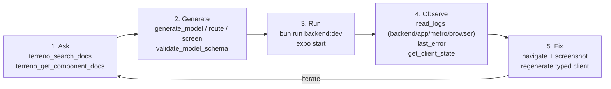

# Implementation Plan: The AI Development Loop (Boost)

**Status:** Draft — key decisions recorded (2026-07-29)
**Roadmap issue:** https://github.com/FlourishHealth/terreno/issues/1014
**Priority:** High
**Effort:** Big batch
**Owner:** unassigned
**Created:** 2026-07-27
**Program:** [OSS launch](oss-launch-program.md)
**Depends on:** PR [#802](https://github.com/flourishhealth/terreno/pull/802) merging (assumed)
**RTK deprecation flag:** **Partial** — `get_rtk_state` and `installTerrenoDevConsoleLogger` are RTK-named surfaces delivered by #802 that must be renamed or relocated after #869. Marked tasks are blocked on both PRs.

## Goal

Turn Terreno's AI-native pillar from a claim into a documented, demonstrable loop. The machinery mostly exists after PR #802 lands: an agent can search current docs, generate conventional code, run the app, read merged logs from four sources, see the last error with a stack, inspect client state, and drive navigation. What does not exist is any document that explains this as a single workflow, so nobody outside the team knows it is there.

This IP writes the story and closes the gaps that become obvious once the story is written down.

## Non-Goals

- Building new MCP tools beyond renames and small gap-fillers.
- Re-implementing UI automation — #802 deliberately composes `expo-mcp`, Playwright MCP, and Maestro rather than building tap/screenshot tooling.
- The tutorial itself (that is [`docs-tutorials-ai-first`](docs-tutorials-ai-first.md), which depends on this IP's reference content).
- Langfuse/observability for AI features inside consumer apps (that is `terreno-langfuse-integration.md`).

## Blocking questions

**Recorded 2026-07-29** (defaults accepted).

| # | Question | Decision |
|---|----------|----------|
| AI1 | Replace `get_rtk_state` | **A** — `get_client_state` with a `layer` field |
| AI2 | `installTerrenoDevConsoleLogger` location | **B** — move to `@terreno/syncdb`, re-export from rtk during support window |
| AI3 | Document `evaluate` publicly? | **A** — yes, with `TERRENO_MCP_EVAL=1` gate |
| AI4 | Compose `expo-mcp` + Playwright MCP? | **A** — yes, with configuration |
| AI5 | Hosted MCP auth / rate limiting | **B** — rate limiting by IP before public launch |
| AI6 | MCP URL (→ P4) | **`https://mcp.terreno.app`** |

## Architecture

### The loop, named

The claim worth making is narrow and true: **the agent sees what the app actually did, not a description of it.** Everything else in the *tool* story is table stakes that other frameworks can match.

### Tool layer versus process layer

This loop is only half the AI story, and documenting it alone undersells it. The other half is the `/terreno-*` SDLC pipeline shipped in `plugins/terreno-planning/` — plan, implement test-first, verify in a fresh context, submit with evidence, own the review loop. [`agentic-sdlc-plugin`](agentic-sdlc-plugin.md) owns publishing and documenting it.

| Layer | Answers | Delivered by |
|-------|---------|--------------|
| **Tool** | What can the agent see and do? | MCP servers: docs search, codegen, merged logs, client state, navigation |
| **Process** | In what order should the agent work, and who checks it? | `/terreno-*`: question-first planning, TDD, fresh-context independent review, evidence gates, reactive review loop |

Every document produced by this IP must name both and explain that they compose: the pipeline's implement stage uses the loop's tools, and the loop's tools are most useful when driven by the pipeline's sequencing. `docs/explanation/ai-development-loop.md` and `docs/explanation/agentic-sdlc.md` are companion pages and must cross-link.

### Tool surface after #802

| Tool | Server | Purpose |
|------|--------|---------|
| `terreno_search_docs` | hosted | BM25 search over the docs corpus, multi-query |
| `terreno_get_component_docs` | hosted | Full props table for a `@terreno/ui` component |
| `terreno_get_upgrade_guide` | hosted | Concatenated upgrade notes for a version range |
| `terreno_bootstrap_app` / `terreno_bootstrap_ai_rules` | hosted | Scaffold an app / agent rules |
| `terreno_generate_*`, `terreno_validate_model_schema`, `terreno_install_admin` | hosted | Codegen |
| `application_info` | local | `@terreno/*` and toolchain versions |
| `database_schema` / `database_query` | local | Mongo introspection, read-only allowlist |
| `read_logs` | local | Merged backend + app (CDP) + Metro + browser logs |
| `last_error` | local | Most recent error with stack across sources |
| `get_rtk_state` → `get_client_state` | local | Store and cache inspection |
| `evaluate` / `navigate` | local | CDP runtime, `TERRENO_MCP_EVAL=1` gated |

### Gaps that surface once the story is written

1. **Naming**: `get_rtk_state` is named after a package being deprecated (AI1).
2. **Discovery**: nothing tells a developer to install `terreno-mcp-local`. `docs/reference/mcp-server.md` documents it, but no getting-started path mentions it.
3. **Hermes single-connection contention**: opening React Native DevTools steals the CDP connection the log tools need. #802 mitigates with lazy connect/release and status reporting; users need to know the symptom.
4. **No end-to-end setup guide**: MCP configuration is scattered across the README and the reference page, per-editor, with no single how-to.
5. **Hosted server has no rate limiting** (AI5) — a launch risk.
6. **Composition is undocumented**: `expo-mcp` and Playwright MCP wiring exists in bootstrap output but is not explained (AI4).

### Documentation to produce

| Document | Purpose |
|----------|---------|
| `docs/explanation/ai-development-loop.md` | The five-stage loop, why it is different, what the agent can and cannot see |
| `docs/how-to/set-up-terreno-mcp.md` | Per-editor configuration for both Terreno servers plus composed servers |
| `docs/how-to/debug-with-mcp.md` | Using `read_logs`, `last_error`, `get_client_state`, `navigate` on a real failure |
| `docs/reference/mcp-server.md` | Updated with the complete post-#802 tool surface and every environment variable |
| `docs/explanation/agent-guidelines.md` | How per-package `.ai/` guidelines and `.rulesync/` rules reach an agent, and how consumers extend them |

Companion page owned elsewhere: `docs/explanation/agentic-sdlc.md` (the process layer) from [`agentic-sdlc-plugin`](agentic-sdlc-plugin.md). Neither page should duplicate the other; each links the other as the missing half.

## Models / APIs

No new models. `POST /__terreno/browser-logs` (dev-only, from #802) needs documenting including its production-disabled behavior and the `TERRENO_BROWSER_LOGS` override.

## Notifications

None.

## UI

None. `installTerrenoDevConsoleLogger` is invisible instrumentation.

## Phases

1. **Reconcile with merged #802** — verify the actual tool names, parameters, and environment variables.
2. **Reference completeness** — update `docs/reference/mcp-server.md` to the real surface.
3. **The loop explainer** — `ai-development-loop.md`.
4. **Setup and debug how-tos** — including composed servers.
5. **Gap fixes** — the `get_client_state` rename (post-#869), logger relocation, hosted rate limiting, discovery paths.
6. **Agent guidelines explainer** — how guidelines reach agents and how consumers extend them.

## Feature Flags & Migrations

- `TERRENO_MCP_EVAL=1` gates `evaluate` and `navigate`; never enabled by bootstrap defaults.
- `TERRENO_BROWSER_LOGS` and `NODE_ENV` gate the browser-log route.
- Renaming `get_rtk_state` to `get_client_state` is a breaking MCP tool change: keep the old name as an alias for one release with a deprecation note in its description.

## Not Included / Future Work

- Semantic/vector docs search (BM25 is the v1 answer).
- CDP multiplexing proxy for the Hermes single-connection limit (the fallback plan in #802 if contention proves painful).
- Terreno-authored simulator automation.
- MCP tools generated for consumer app APIs (`model-router-mcp.md`).

## Files to Create / Modify

**Create**

- `docs/explanation/ai-development-loop.md`
- `docs/how-to/set-up-terreno-mcp.md`
- `docs/how-to/debug-with-mcp.md`
- `docs/explanation/agent-guidelines.md`

**Modify**

- `docs/reference/mcp-server.md`, `mcp-server/README.md`
- `mcp-server/src/local/tools/runtime.ts` (tool rename + alias)
- `mcp-server/src/local/localTools.ts` (tool registration)
- `mcp-server/src/index.ts` (rate limiting)
- `rtk/src/devConsoleLogger.ts` → `syncdb/src/devConsoleLogger.ts` (with re-export)
- `docs/reference/environment-variables.md`
- `README.md` (MCP section links the new how-to)

## Task List

See [`docs/tasks/ai-dev-loop-boost.md`](../tasks/ai-dev-loop-boost.md).

## Acceptance Criteria

- [ ] `docs/reference/mcp-server.md` lists every tool, prompt, and resource on both servers, matching the merged code, and every environment variable that affects them.
- [ ] `docs/explanation/ai-development-loop.md` explains the five stages and states precisely what an agent can and cannot observe.
- [ ] `docs/explanation/ai-development-loop.md` distinguishes the tool layer from the process layer, and cross-links `docs/explanation/agentic-sdlc.md` as the other half of the AI story.
- [ ] `docs/how-to/set-up-terreno-mcp.md` gives working configuration for at least Cursor and Claude Code, covering both Terreno servers, and explains when to add `expo-mcp` and Playwright MCP.
- [ ] `docs/how-to/debug-with-mcp.md` walks a real failure from symptom to fix using `last_error` and `read_logs`, with real tool output.
- [ ] The Hermes single-CDP-connection limitation is documented with its symptom and the workaround.
- [ ] `evaluate` and `navigate` are documented with the `TERRENO_MCP_EVAL` gate and the security reasoning for it.
- [ ] `get_client_state` exists, works against both store types, reports which layer it found, and `get_rtk_state` remains as a deprecated alias for one release.
- [ ] `installTerrenoDevConsoleLogger` is exported from the supported client package with a re-export from `@terreno/rtk` for the support window.
- [ ] The hosted MCP server enforces rate limiting, with the limit documented and a clear error response when exceeded.
- [ ] `POST /__terreno/browser-logs` is documented including that it 404s in production.
- [ ] A bootstrapped app's generated `mcp.json` matches the setup how-to exactly.
- [ ] `bun run mcp:build`, `bun run lint`, `bun run compile`, and `bun run rules:check` all pass.
