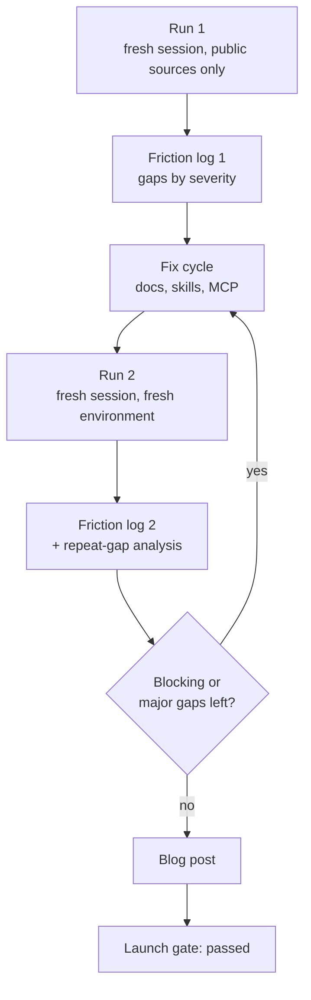

# Implementation Plan: Dogfooding Run and Launch Blog Post

**Status:** Draft — key decisions recorded (2026-07-29)
**Roadmap issue:** https://github.com/FlourishHealth/terreno/issues/1015
**Priority:** High (this is the program's acceptance test)
**Effort:** Big batch
**Owner:** unassigned
**Created:** 2026-07-27
**Program:** [OSS launch](oss-launch-program.md)
**Depends on:** [`docs-tutorials-ai-first`](docs-tutorials-ai-first.md), [`ai-dev-loop-boost`](ai-dev-loop-boost.md), [`deploy-to-vercel`](deploy-to-vercel.md), [`docs-reference-coverage`](docs-reference-coverage.md)
**RTK deprecation flag:** **Blocked** — the build must be performed against the supported stack (syncdb + Better Auth). A dogfooding run on the deprecated data layer would produce a friction log and a blog post that are both obsolete on publication.

## Goal

Prove the launch claim by testing it, then publish the result. The [`build-terreno-app`](../../.rulesync/skills/build-terreno-app/SKILL.md) skill is the harness; this IP is the run, the fixes that come out of it, and the blog post.

The program's launch gate is: **if an agent following only public documentation and published skills cannot build and deploy a real universal app, the launch is not ready.** This IP executes that test. Its most likely outcome is a list of documentation gaps, which is exactly what it is for.

## Non-Goals

- Writing the skill (already done — this IP runs it).
- Shipping the demo app as a maintained Terreno example. It is a blog-post artifact, not a fourth example app to keep updated.
- Marketing beyond the blog post.
- Building every app concept. One run, one app.

## Blocking questions

**Recorded 2026-07-29** (defaults accepted).

| # | Question | Decision |
|---|----------|----------|
| B1 | App concept | **Pantry** — leads on syncdb conflict resolution |
| B2 | Public demo repo? | **A** — `flourishhealth/terreno-pantry` |
| B3 | Who performs the run? | **C** if capacity; else **A** |
| B4 | Runs before publish | **B** — two runs with fix cycle between |
| B5 | Publication venue | **A** — docs site blog only |
| B6 | Name the model? | **A** — yes, with version |

## Architecture

### Run structure

The loop between the gap check and the fix cycle is the point. Exiting after one pass would mean publishing a launch claim that was never re-tested.

### What counts as passing

| Gate | Threshold |
|------|-----------|
| Blocking gaps | zero |
| Major gaps | zero at launch; any found in run 1 must be fixed and confirmed in run 2 |
| Minor gaps | acceptable, all filed as issues |
| App completeness | every slice in the chosen concept working on web and one native target |
| Differentiators | all six demonstrated with artifacts (AI, offline, realtime, admin, universal, feature flags) |
| Deployment | public URL, all four verification checks passing |
| Debug loop | the deliberate bug found via `last_error` / `read_logs` without reading framework source |

The debug-loop gate is the one that most directly tests the AI-native pillar. If the agent has to read `@terreno/api` source to diagnose a bug in its own app, the pillar is not real yet.

### Fix routing

Gaps found in a run do not get fixed inside this IP. They route to the IP that owns the surface:

| Gap type | Routes to |
|----------|-----------|
| Tutorial wrong or incomplete | [`docs-tutorials-ai-first`](docs-tutorials-ai-first.md) |
| Reference page missing or wrong | [`docs-reference-coverage`](docs-reference-coverage.md) |
| MCP tool or agent-loop gap | [`ai-dev-loop-boost`](ai-dev-loop-boost.md) |
| Deployment guide or skill gap | [`deploy-to-vercel`](deploy-to-vercel.md) / [`deploy-to-gcp`](deploy-to-gcp.md) |
| Bootstrap output wrong | [`rtk-to-syncdb-migration-docs`](rtk-to-syncdb-migration-docs.md) (agent surfaces) or the MCP server |
| Positioning inconsistency | [`positioning-django-rails-universal`](positioning-django-rails-universal.md) |
| Genuine framework bug | a new issue, triaged normally |

This keeps ownership clear and prevents this IP from absorbing the whole program.

## Models / APIs

None in Terreno. The demo app's models come from the chosen concept and live in its own repository.

## Notifications

None.

## UI

The demo app's screens live in its own repository. No changes to `@terreno/ui` unless the run finds a bug, which routes out per the table above.

## Phases

1. **Run 1** — fresh session, public sources only, friction log produced.
2. **Triage** — classify every gap, route to owning IPs, file issues.
3. **Fix cycle** — owning IPs land their fixes (tracked, not performed here).
4. **Run 2** — fresh session and fresh environment, second friction log, repeat-gap analysis.
5. **Gate** — confirm zero blocking and zero major gaps, or loop back to phase 3.
6. **Blog post** — draft, artifact review, fact check, publish.
7. **Retrospective** — record what the harness itself got wrong so the skill improves.

## Feature Flags & Migrations

None.

## Not Included / Future Work

- A recurring dogfooding cadence (worth doing quarterly; propose separately once the first run has calibrated the effort).
- Building the other four app concepts.
- Maintaining the demo app past the post.
- Comparative benchmarks against other frameworks.

## Files to Create / Modify

**Create**

- `docs/explanation/dogfooding-results.md` (the public summary of both runs)
- The demo app repository (outside this repo, per B2)

**Modify**

- `.rulesync/skills/build-terreno-app/SKILL.md` and its references (retrospective improvements)
- `website/blog/` (the post, if the docs site gains a blog)
- Whichever documents the fix cycle touches — owned by their IPs

## Task List

See [`docs/tasks/build-terreno-app-validation.md`](../tasks/build-terreno-app-validation.md).

## Acceptance Criteria

- [ ] Run 1 completed with a friction log classifying every gap by severity, phase, and suggested fix.
- [ ] Every blocking and major gap from run 1 is filed as an issue and routed to an owning IP.
- [ ] Run 2 completed in a fresh environment after fixes, with its own friction log.
- [ ] Run 2 reports zero blocking gaps and zero major gaps.
- [ ] Any gap appearing in both runs is called out explicitly with an explanation of why the fix did not work.
- [ ] The demo app implements every slice of the chosen concept and runs on web and one native target.
- [ ] All six differentiators are demonstrated with artifacts in `/opt/cursor/artifacts/`.
- [ ] The deliberate bug was found using only `last_error` and `read_logs`, without reading framework source, and the elapsed time is recorded.
- [ ] The app is deployed to a public URL with all four verification checks passing.
- [ ] `BLOG_DRAFT.md` follows the outline, includes a "what did not work" section with three real gaps, and names the model and version used.
- [ ] Every claim in the post is verified against an artifact by someone who did not perform the run.
- [ ] `docs/explanation/dogfooding-results.md` publishes both runs' gap counts and what changed between them.
- [ ] The `build-terreno-app` skill is updated with retrospective improvements, and mirrors are regenerated.
