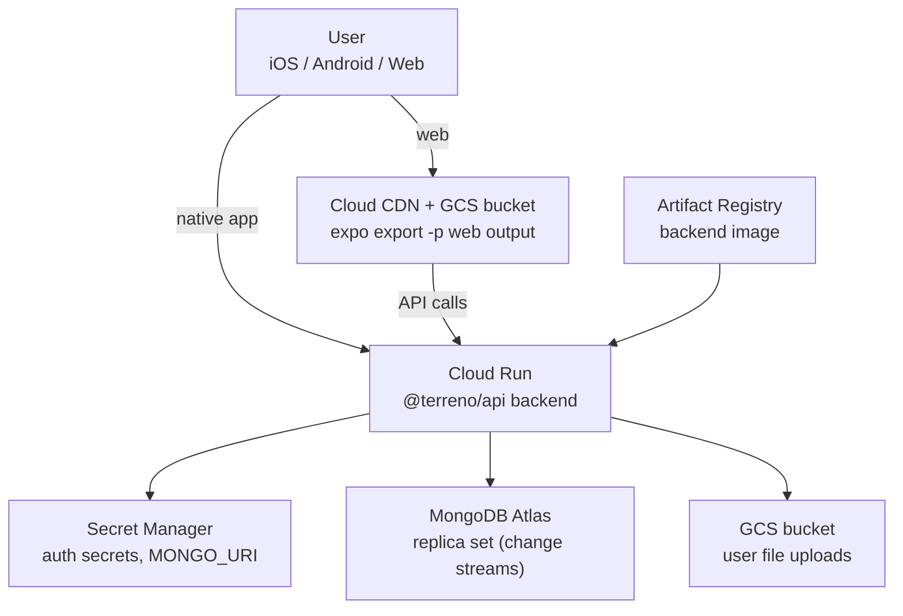

# Implementation Plan: Deploy to GCP (Generalized) + `deploy-gcp` Skill

**Status:** Approved — decisions recorded (2026-07-29)
**Roadmap issue:** https://github.com/FlourishHealth/terreno/issues/1005
**Priority:** High
**Effort:** Big batch
**Owner:** unassigned
**Created:** 2026-07-27
**Program:** [OSS launch](oss-launch-program.md)
**Depends on:** [`deployment-foundation`](deployment-foundation.md) for the shared Dockerfile and env reference (soft dependency — Phase 1 can start in parallel)
**RTK deprecation flag:** None for the backend and infrastructure. The frontend build step is data-layer agnostic (`expo export -p web` output is static either way). The only RTK-adjacent content is the `EXPO_PUBLIC_API_URL` env var, which survives the syncdb migration.

## Goal

Turn Terreno's GCP deployment story from "how Flourish deploys Terreno" into "how anyone deploys a Terreno app to GCP", and give agents a skill that can execute it. Today `docs/how-to/deploy-to-gcp.md` hardcodes the `flourish-terreno` project, `flourish-terreno-terreno-demo` bucket names, and Flourish's service-account layout; `terraform/README.md` is Flourish-specific; and `scripts/setup-gcs-hosting.sh` provisions Flourish's two static sites. None of it is reusable by an outside user, and no skill wraps any of it.

## Non-Goals

- Multi-region or multi-environment (staging/prod) topologies beyond a documented single extra environment.
- Kubernetes/GKE. Cloud Run only.
- Managing MongoDB inside GCP. Mongo Atlas is the documented path; self-hosted Mongo is explicitly out of scope.
- Replacing Flourish's existing terraform — that is relocated, not rewritten (see program question P5).

## Blocking questions

**Recorded 2026-07-29.**

| # | Question | Decision |
|---|----------|----------|
| GC1 | Frontend web hosting | **GCS + Cloud CDN as GCP default**, plus **Netlify** (document the existing Flourish/Terreno Netlify pattern as a first-class alternative for static web export) |
| GC2 | Database guidance | **MongoDB Atlas only** for launch; add a **future-work note** toward Postgres when the data layer supports it |
| GC3 | terraform or gcloud | **C** — `gcloud` quickstart + terraform for production |
| GC4 | Reusable terraform module | **B** — `terraform/modules/terreno-backend/` |
| GC5 | Flourish infra location (→ P5) | **C** — `infra/flourish/` now; **migrate to B** (private repo) post-launch |
| GC6 | `deploy-gcp` skill deploys? | **C** — full deploy behind explicit confirmation gate |
| GC7 | Secret management | **A** — Secret Manager for secrets; plain env for non-secrets |

## Architecture

### Reference topology (documented default)

**GCP path:** GCS + Cloud CDN for static web export (see diagram below).

**Netlify path:** Document the existing Terreno/Flourish Netlify static hosting pattern as a first-class alternative for `expo export -p web` — same backend topology, different static host.

### Required GCP resources

| Resource | Purpose | Notes |
|----------|---------|-------|
| Artifact Registry repo | backend container images | Regional, Docker format |
| Cloud Run service | backend | Min instances 0 for dev, ≥1 for prod (cold starts break websockets); `--session-affinity` required for Socket.io |
| Secret Manager secrets | auth secrets + `MONGO_URI` | Mounted as env vars via `--set-secrets` |
| GCS bucket (web) | static web export | `notFoundPage=index.html` for client-side routing |
| Backend bucket + URL map + IP + proxy + forwarding rule | Cloud CDN in front of the web bucket | The five resources the current script creates |
| GCS bucket (uploads) | user file storage | Separate from the web bucket; not public |
| Service account (runtime) | Cloud Run identity | `roles/secretmanager.secretAccessor`, `roles/storage.objectAdmin` on the uploads bucket only |
| Service account (deploy) | CI identity | Prefer Workload Identity Federation over JSON keys |

### Websocket and change-stream constraints to document

These are the non-obvious failure modes and must be called out explicitly:

- Socket.io on Cloud Run requires `--session-affinity` and a request timeout raised from the 300s default.
- Change streams (realtime + feature-flag live updates) require a replica set. A standalone `mongod` silently fails at startup — the guide must say so.
- Scaling to zero drops websocket connections; the client reconnects, but feature-flag live updates lag. Recommend `--min-instances=1` for anything user-facing.
- `corsOrigin` in `setupServer` must include the CDN domain, and Better Auth needs the web origin in `trustedOrigins`.

### `deploy-gcp` skill shape

New skill at `.rulesync/skills/deploy-gcp/SKILL.md`, generated into all agent targets. Structure:

1. **Preflight** — detect project layout (bootstrap `backend/`+`frontend/` vs monorepo), read `gcloud config`, verify required APIs enabled, verify `MONGO_URI` points at a replica set.
2. **Plan** — print the exact resources to be created/updated and the target project, region, and service names. Require explicit user confirmation before mutating anything (GC6).
3. **Backend** — build image, push to Artifact Registry, create/update secrets, deploy Cloud Run with session affinity and the correct env/secret wiring.
4. **Frontend** — `expo export -p web`, sync to the web bucket, invalidate CDN cache.
5. **Verify** — `curl <backend>/health` expecting `"healthy":true`, fetch the web root, confirm the SPA loads, print URLs.
6. **Troubleshoot** — a table of symptom → cause → fix covering the four constraints above.

## Models

None.

## APIs

None new. The guide relies on the existing `/health` endpoint from `@terreno/api-health` for verification.

## Notifications

None.

## UI

None.

## Phases

1. **Generalize the how-to** — rewrite `docs/how-to/deploy-to-gcp.md` as a project-agnostic guide covering backend + frontend, with placeholder variables and the constraints section.
2. **Terraform module** — extract a reusable `terraform/modules/terreno-backend/` module; relocate Flourish-specific config to `infra/flourish/`.
3. **Scripts** — parameterize `scripts/setup-gcs-hosting.sh` to take project/bucket/site names as arguments instead of hardcoding Flourish's.
4. **Skill** — author `deploy-gcp` in `.rulesync/skills/` and generate mirrors.
5. **Validate** — deploy the example stack to a scratch GCP project using only the public guide, then fix what the guide got wrong.

## Feature Flags & Migrations

No product flags. Moving `terraform/` to `infra/flourish/` breaks paths referenced by `.github/workflows/cd.yml` and `terraform/README.md`; both must be updated in the same commit.

## Not Included / Future Work

- Multi-environment terraform workspaces beyond one documented staging example.
- Cost estimation guidance.
- Cloud Armor / WAF configuration.
- Deploying the hosted MCP server (that is Flourish's own infra, documented in `infra/flourish/`).
- SSR-capable web hosting — depends on [`web-ssr-and-admin-spa`](web-ssr-and-admin-spa.md).

## Files to Create / Modify

**Create**

- `docs/how-to/deploy-backend-to-cloud-run.md`
- `docs/how-to/deploy-web-to-gcs-cdn.md`
- `docs/explanation/deployment-architecture-gcp.md`
- `terraform/modules/terreno-backend/{main.tf,variables.tf,outputs.tf,README.md}`
- `.rulesync/skills/deploy-gcp/SKILL.md`
- `.rulesync/skills/deploy-gcp/references/troubleshooting.md`

**Modify**

- `docs/how-to/deploy-to-gcp.md` (becomes an index pointing at the two new guides, or is deleted with redirects)
- `docs/how-to/README.md`
- `scripts/setup-gcs-hosting.sh` (parameterize)
- `terraform/README.md` (split generic vs Flourish)
- `.github/workflows/cd.yml`, `.github/workflows/demo-deploy.yml`, `.github/workflows/frontend-example-deploy.yml` (path updates if terraform moves)
- `example-backend/Dockerfile` (created by [`deployment-foundation`](deployment-foundation.md); referenced here)

## Task List

See [`docs/tasks/deploy-to-gcp.md`](../tasks/deploy-to-gcp.md).

## Acceptance Criteria

- [ ] `docs/how-to/deploy-backend-to-cloud-run.md` contains no `flourish` string and no hardcoded project ID, bucket name, or service URL.
- [ ] The backend guide documents session affinity, request timeout, min-instances, and the replica-set requirement, each with the symptom that occurs when it is missed.
- [ ] The web guide covers `expo export -p web`, bucket configuration with `notFoundPage=index.html`, CDN setup, cache invalidation, and setting `EXPO_PUBLIC_API_URL` at build time.
- [ ] `terraform/modules/terreno-backend/` applies cleanly against a scratch project with only variables supplied, creating Cloud Run + Artifact Registry + secrets + service accounts.
- [ ] `scripts/setup-gcs-hosting.sh` accepts project and site names as arguments and contains no Flourish defaults.
- [ ] The `deploy-gcp` skill exists in `.rulesync/skills/` and all generated mirrors are committed (`bun run rules:check` exits 0).
- [ ] The skill's plan step prints project, region, and service names and stops for confirmation before any mutating command.
- [ ] A full deploy of `example-backend` + `example-frontend` to a scratch GCP project succeeds following only the public docs, and `curl <backend>/health` returns `"healthy":true`.
- [ ] All Flourish-specific infrastructure lives under `infra/flourish/` and CI still passes.
