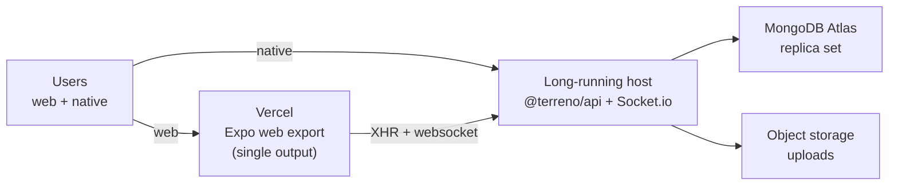
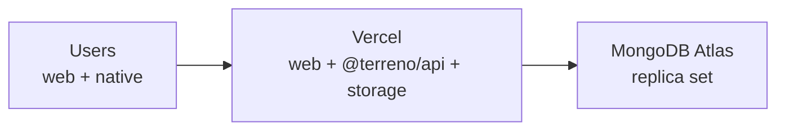

# Implementation Plan: Deploy to Vercel + `deploy-vercel` Skill

**Status:** Approved — open Vercel spike TODOs; other decisions recorded (2026-07-29)
**Roadmap issue:** https://github.com/FlourishHealth/terreno/issues/1012
**Priority:** High
**Effort:** Big batch
**Owner:** unassigned
**Created:** 2026-07-27
**Program:** [OSS launch](oss-launch-program.md)
**Depends on:** [`deployment-foundation`](deployment-foundation.md)
**RTK deprecation flag:** **Partial** — the web build and client configuration sections depend on the frontend data layer; the syncdb websocket transport also has implications for which parts of the app can be served from serverless functions. Marked tasks must be re-verified after PR #869.

## Goal

Give Terreno the fastest possible "my app is on the internet" path, and a skill that executes it. Vercel is where most JavaScript developers expect to deploy, and Expo Router has first-class Vercel support (`vercel.json` with `expo export -p web`, plus `expo-server/adapter/vercel` for server output). Terreno currently has zero Vercel documentation — the only occurrences of "Vercel" in the repo refer to the Vercel **AI SDK** inside `@terreno/ai`, which is a completely different thing and is itself a source of confusion worth addressing.

**Topology is not finalized.** A pre-implementation spike must answer whether a single-platform Vercel deploy (web + `@terreno/api` + file storage) is viable, or whether the documented path remains split (static web on Vercel, long-lived backend elsewhere). Until the spike completes, this IP documents the **interim split topology** and tracks open questions as TODOs.

## Non-Goals

- Committing to a Vercel backend topology before the spike (see **Open TODOs** below).
- Vercel-hosted MongoDB (does not exist; Atlas is the answer).
- Native app distribution (that is EAS; see the `expo-deployment` skill).

## Blocking questions

**Recorded 2026-07-29** (defaults accepted where not marked open).

| # | Question | Decision |
|---|----------|----------|
| V1 | Backend host | **Open — spike required.** Candidate: all-in-one on Vercel (web + backend + Blob storage). Fallback: Railway/Render/Fly + Vercel static web (see [`deployment-foundation`](deployment-foundation.md)). **Do not publish a final answer until TODOs below are closed.** |
| V2 | Document `server` output? | **Open — depends on V1 spike.** Default if documented: advanced section, Expo SDK ≥ 55, SSE buffering caveat |
| V3 | Commit `vercel.json`? | **Open — depends on V1 spike.** Candidate: wired to real deployment in `example-frontend` and `example-backend` |
| V4 | Preview deployments | **A** — include CORS + Better Auth `trustedOrigins` for preview URLs |
| V5 | Disambiguate Vercel AI SDK vs hosting | **A** — consistent phrasing: "the Vercel AI SDK" vs "Vercel (hosting)" |

## Open TODOs (pre-implementation spike)

Complete these before Phase 1 of the how-to guide ships:

- [ ] **V1-todo:** Can `@terreno/api` run on Vercel with Socket.io sessions and MongoDB change streams? Document runtime limits, cold starts, and whether session affinity is available.
- [ ] **V1-todo:** Can `@terreno/ai` SSE streaming work through `expo-server/adapter/vercel` without unacceptable buffering?
- [ ] **V1-todo:** Where do user file uploads land on an all-in-one Vercel deploy (Blob, external GCS, or other)?
- [ ] **V1-todo:** Compare all-in-one Vercel vs split (Vercel web + long-running backend) on cost, ops complexity, and preview-deployment ergonomics.
- [ ] **V2-todo:** If `server` output is documented, confirm Expo SDK ≥ 55+ requirements and list which Terreno features break under static/server export.
- [ ] **V3-todo:** If committing `vercel.json`, confirm CI/deploy wiring for `example-frontend` and `example-backend` and who owns the Vercel project.

## Architecture

### Interim topology (document until spike closes)

Until V1 is decided, document this split layout — it is known to work:



The web deployment is static; dynamic operations go to the backend. Vercel needs SPA rewrites and build-time `EXPO_PUBLIC_API_URL`.

### Candidate topology (if spike succeeds)



**Do not document this as the recommended path until all V1 TODOs are checked.**

### `vercel.json` for `single` output

Per Expo's published configuration, the SPA case needs rewrites so client-side routes resolve:

```json
{
  "buildCommand": "expo export -p web",
  "outputDirectory": "dist",
  "devCommand": "expo",
  "cleanUrls": true,
  "framework": null,
  "rewrites": [{ "source": "/:path*", "destination": "/" }]
}
```

### `vercel.json` for `server` output (advanced)

Server output changes the shape: `dist/client` is served statically and a function handles everything else via `expo-server/adapter/vercel`, with `includeFiles` pulling in `dist/server/**`. Document only after V2 TODOs close. Flag the streaming caveat for `@terreno/ai` chat.

### The preview-deployment problem

Vercel gives every PR a unique origin. That breaks two things:

1. **CORS** — `corsOrigin` in `setupServer` must accept the preview origin. Document a pattern (a function or regex matching `https://<project>-*.vercel.app`) rather than `corsOrigin: true`, and say plainly that `true` is not acceptable in production.
2. **Better Auth `trustedOrigins`** — same problem, separate config, and OAuth redirect URIs must be registered per provider.

This section ships regardless of V1 outcome.

### `deploy-vercel` skill

New skill at `.rulesync/skills/deploy-vercel/SKILL.md`:

1. **Detect** — is this an Expo Router web app; what is `web.output` in the app config; is there an existing `vercel.json`.
2. **Configure** — write or update `vercel.json` for the detected output mode; add the `vercel-build` script when using server output.
3. **Wire the backend** — determine the backend URL (per finalized V1 decision), set `EXPO_PUBLIC_API_URL` as a Vercel environment variable per environment (production/preview/development), and print the CORS and `trustedOrigins` changes the user must make on the backend.
4. **Deploy** — `vercel` / `vercel --prod`, with a confirmation gate before the first production deploy.
5. **Verify** — load the deployed URL, confirm the app boots, confirm an authenticated request reaches the backend, and confirm the websocket connects.
6. **Troubleshoot** — blank page (missing rewrites), 404 on refresh (same), API calls to localhost (`EXPO_PUBLIC_API_URL` not set at build time), CORS failure, websocket failure, buffered SSE on server output.

The verification step must include the websocket check. A Terreno web app can look completely fine while realtime and live feature flags are silently broken.

## Models / APIs / Notifications / UI

None.

## Phases

0. **Spike** — close all **Open TODOs** above; record decision on V1/V2/V3 in this file.
1. **How-to guide** — `single` output, clone → public URL (topology per V1 outcome).
2. **Preview deployments and origins** — CORS, `trustedOrigins`, OAuth redirects.
3. **Advanced: server output** — only if V2 is approved.
4. **Skill** — author and generate mirrors.
5. **Validate** — deploy examples per V3 outcome.

## Feature Flags & Migrations

None.

## Not Included / Future Work

- EAS native distribution (separate skill).
- Multi-region Vercel edge configuration.

## Files to Create / Modify

**Create**

- `docs/how-to/deploy-to-vercel.md` (blocked on Phase 0 spike)
- `.rulesync/skills/deploy-vercel/SKILL.md`

**Modify (after V3 decision)**

- `example-frontend/vercel.json` (candidate)
- `example-backend/vercel.json` (candidate — only if all-in-one path wins)

## Task List

See [`docs/tasks/deploy-to-vercel.md`](../tasks/deploy-to-vercel.md).

## Acceptance Criteria

- [ ] All **Open TODOs** are closed with a written decision on V1, V2, and V3.
- [ ] `docs/how-to/deploy-to-vercel.md` matches the decided topology (not the interim split doc if all-in-one wins, and vice versa).
- [ ] Preview-deployment CORS and `trustedOrigins` guidance is present.
- [ ] `deploy-vercel` skill includes websocket verification in its checklist.
- [ ] Vercel AI SDK vs Vercel hosting disambiguation appears in both `@terreno/ai` and deployment docs.
