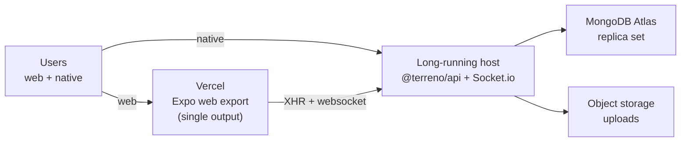

# Implementation Plan: Deploy to Vercel + `deploy-vercel` Skill

**Status:** Draft — blocking questions open
**Priority:** High
**Effort:** Big batch
**Owner:** unassigned
**Created:** 2026-07-27
**Program:** [OSS launch](oss-launch-program.md)
**Depends on:** [`deployment-foundation`](deployment-foundation.md)
**RTK deprecation flag:** **Partial** — the web build and client configuration sections depend on the frontend data layer; the syncdb websocket transport also has implications for which parts of the app can be served from serverless functions. Marked tasks must be re-verified after PR #869.

## Goal

Give Terreno the fastest possible "my app is on the internet" path, and a skill that executes it. Vercel is where most JavaScript developers expect to deploy, and Expo Router has first-class Vercel support (`vercel.json` with `expo export -p web`, plus `expo-server/adapter/vercel` for server output). Terreno currently has zero Vercel documentation — the only occurrences of "Vercel" in the repo refer to the Vercel **AI SDK** inside `@terreno/ai`, which is a completely different thing and is itself a source of confusion worth addressing.

The honest constraint that shapes this whole IP: **the Terreno backend does not belong on Vercel serverless functions.** It holds Socket.io connections and MongoDB change streams, both of which need a long-lived process. So the recommended topology is split: web frontend on Vercel, backend on a long-running host.

## Non-Goals

- Making `@terreno/api` run on Vercel serverless functions.
- Vercel-hosted MongoDB (does not exist; Atlas is the answer).
- Expo Router API routes as a replacement for the `@terreno/api` backend.
- Native app distribution (that is EAS; see the `expo-deployment` skill).

## Blocking questions

| # | Question | Options | Recommended default (pending confirmation) |
|---|----------|---------|--------------------------------------------|
| V1 | What is the recommended backend host in the Vercel guide? | (A) GCP Cloud Run (matches the other guide). (B) Fly.io / Railway / Render (closest to Vercel's ergonomics). (C) Vercel-adjacent long-running option. | **B** as the guide's primary (Railway or Render — one command, no cloud console), linking [`deploy-to-gcp`](deploy-to-gcp.md) for production. Pick exactly one and name it |
| V2 | Do we document `server` output on Vercel? | (A) No, `single` only for now. (B) Yes, as an advanced section. (C) Yes, as the recommendation. | **B** — document it as advanced and explicitly gate it on Expo SDK ≥ 55, noting that SSR is alpha. Also document the known streaming caveat: responses through `expo-server/adapter/vercel` may be buffered rather than streamed, which matters for `@terreno/ai` SSE chat |
| V3 | Do we commit a `vercel.json` to `example-frontend`? | (A) Yes, wired to a real deployment. (B) Yes, as an unused reference. (C) No, docs only. | **A** if we are willing to run a second public frontend deployment; otherwise **B**. Recommend **B** — the existing Netlify deployment already covers the "live example" need, and an unmaintained second deployment rots |
| V4 | Does the guide cover preview deployments? | (A) Yes, including per-PR backend origins in CORS. (B) No. | **A** — Vercel's preview URLs are the feature people come for, and they break CORS and Better Auth `trustedOrigins` in a way that needs a documented wildcard/regex answer |
| V5 | How do we disambiguate "Vercel AI SDK" from "deploying to Vercel"? | (A) A note in both docs. (B) Rename references to "AI SDK by Vercel". | **A** plus consistent phrasing — always write "the Vercel AI SDK" for the library and "Vercel (hosting)" in deployment contexts |

## Architecture

### Recommended topology



The web deployment is static; every dynamic operation goes to the backend. This means Vercel needs exactly one piece of configuration (SPA rewrites) and one build-time variable (`EXPO_PUBLIC_API_URL`).

### `vercel.json` for `single` output

Per Expo's published configuration, the SPA case needs rewrites so client-side routes resolve:

```json
{
  "buildCommand": "expo export -p web",
  "outputDirectory": "dist",
  "devCommand": "expo",
  "cleanUrls": true,
  "framework": null,
  "rewrites": [{ "source": "/:path*", "destination": "/" }]
}
```

### `vercel.json` for `server` output (advanced)

Server output changes the shape: `dist/client` is served statically and a function handles everything else via `expo-server/adapter/vercel`, with `includeFiles` pulling in `dist/server/**`. This is the path that unlocks SSR and Expo Router API routes, and it is the bridge to [`web-ssr-and-admin-spa`](web-ssr-and-admin-spa.md). Document it as advanced, gated on SDK ≥ 55, and flag the streaming caveat.

### The preview-deployment problem

Vercel gives every PR a unique origin. That breaks two things:

1. **CORS** — `corsOrigin` in `setupServer` must accept the preview origin. Document a pattern (a function or regex matching `https://<project>-*.vercel.app`) rather than `corsOrigin: true`, and say plainly that `true` is not acceptable in production.
2. **Better Auth `trustedOrigins`** — same problem, separate config, and OAuth redirect URIs must be registered per provider.

This is the single most valuable section in the guide because it is where every Vercel + separate-backend setup fails first.

### `deploy-vercel` skill

New skill at `.rulesync/skills/deploy-vercel/SKILL.md`:

1. **Detect** — is this an Expo Router web app; what is `web.output` in the app config; is there an existing `vercel.json`.
2. **Configure** — write or update `vercel.json` for the detected output mode; add the `vercel-build` script when using server output.
3. **Wire the backend** — determine the backend URL, set `EXPO_PUBLIC_API_URL` as a Vercel environment variable per environment (production/preview/development), and print the CORS and `trustedOrigins` changes the user must make on the backend.
4. **Deploy** — `vercel` / `vercel --prod`, with a confirmation gate before the first production deploy.
5. **Verify** — load the deployed URL, confirm the app boots, confirm an authenticated request reaches the backend, and confirm the websocket connects.
6. **Troubleshoot** — blank page (missing rewrites), 404 on refresh (same), API calls to localhost (`EXPO_PUBLIC_API_URL` not set at build time), CORS failure, websocket failure, buffered SSE on server output.

The verification step must include the websocket check. A Terreno web app can look completely fine while realtime and live feature flags are silently broken.

## Models / APIs / Notifications / UI

None.

## Phases

1. **How-to guide** — `single` output, the full path from clone to public URL.
2. **Preview deployments and origins** — CORS, `trustedOrigins`, OAuth redirects.
3. **Advanced: server output** — gated on SDK ≥ 55, with the streaming caveat.
4. **Skill** — author and generate mirrors.
5. **Validate** — deploy the example frontend to a scratch Vercel project against a real backend.

## Feature Flags & Migrations

None.

## Not Included / Future Work

- Running `@terreno/api` itself on Vercel.
- Vercel Edge Middleware usage.
- Multi-region deployment.
- Cloudflare Workers / Netlify equivalents (the `expo-server` adapters exist for both; a follow-up IP can cover them once this pattern is proven).

## Files to Create / Modify

**Create**

- `docs/how-to/deploy-web-to-vercel.md`
- `.rulesync/skills/deploy-vercel/SKILL.md`
- `.rulesync/skills/deploy-vercel/references/troubleshooting.md`
- `example-frontend/vercel.json` (reference configuration per V3)

**Modify**

- `docs/how-to/README.md`
- `docs/explanation/deployment-baseline.md` (link Vercel as a hosting option)
- `docs/reference/ai.md` (disambiguate "the Vercel AI SDK" per V5)
- `docs/reference/environment-variables.md` (note Vercel per-environment variable scoping)

## Task List

See [`docs/tasks/deploy-to-vercel.md`](../tasks/deploy-to-vercel.md).

## Acceptance Criteria

- [ ] `docs/how-to/deploy-web-to-vercel.md` takes a reader from a Terreno app to a public Vercel URL with a working login against a deployed backend.
- [ ] The guide states plainly that the Terreno backend must not run on Vercel serverless functions, and why (Socket.io, change streams).
- [ ] The guide names one specific recommended backend host and links the GCP guide for production.
- [ ] The `vercel.json` for `single` output is present and verified by an actual deployment.
- [ ] Client-side routes resolve on refresh in the deployed app (verified by loading a deep link directly).
- [ ] The preview-deployment section documents CORS and Better Auth `trustedOrigins` patterns for wildcard preview origins, and states that `corsOrigin: true` is unacceptable in production.
- [ ] The server-output section is labeled advanced, gated on Expo SDK ≥ 55, and documents the buffered-streaming caveat with its impact on `@terreno/ai` SSE chat.
- [ ] The `deploy-vercel` skill exists with all mirrors committed (`bun run rules:check` exits 0).
- [ ] The skill's verification step checks page load, an authenticated API call, and websocket connectivity.
- [ ] The troubleshooting reference covers all six failure modes with the exact symptom for each.
- [ ] Every use of "Vercel" in the repo is unambiguous: "the Vercel AI SDK" for the library, "Vercel" alone only in hosting contexts.
