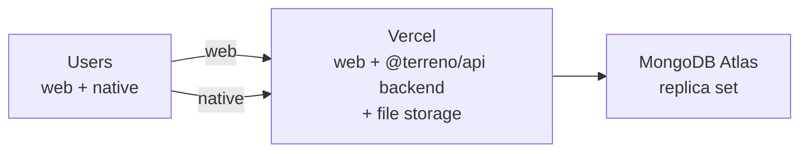

# Implementation Plan: Deploy to Vercel + `deploy-vercel` Skill

**Status:** Draft — key decisions recorded (2026-07-29)
**Priority:** High
**Effort:** Big batch
**Owner:** unassigned
**Created:** 2026-07-27
**Program:** [OSS launch](oss-launch-program.md)
**Depends on:** [`deployment-foundation`](deployment-foundation.md)
**RTK deprecation flag:** **Partial** — the web build and client configuration sections depend on the frontend data layer; the syncdb websocket transport also has implications for which parts of the app can be served from serverless functions. Marked tasks must be re-verified after PR #869.

## Goal

Give Terreno the fastest possible "my app is on the internet" path, and a skill that executes it. Vercel is where most JavaScript developers expect to deploy, and Expo Router has first-class Vercel support (`vercel.json` with `expo export -p web`, plus `expo-server/adapter/vercel` for server output). Terreno currently has zero Vercel documentation — the only occurrences of "Vercel" in the repo refer to the Vercel **AI SDK** inside `@terreno/ai`, which is a completely different thing and is itself a source of confusion worth addressing.

The recommended topology is **all-in-one on Vercel**: web frontend, **backend (`@terreno/api`)**, and **user file storage** on the same platform. This replaces the earlier split-host assumption (static web on Vercel + long-running backend elsewhere). Document the constraints explicitly: Socket.io, change streams, and SSE streaming must be validated against Vercel's runtime limits; call out buffering caveats for `@terreno/ai` chat.

## Non-Goals

- Native app distribution (that is EAS; see the `expo-deployment` skill).
- Presenting GCP/Netlify as the *primary* path in this IP (see [`deploy-to-gcp`](deploy-to-gcp.md) and Netlify notes there).

## Blocking questions

**Recorded 2026-07-29.**

| # | Question | Decision |
|---|----------|----------|
| V1 | Backend host | **Vercel hosts the backend** — single-platform deploy. User uploads / static assets may also use **Vercel storage** (Blob or equivalent); document the unified topology |
| V2 | Document `server` output? | **Default: B** — advanced section, Expo SDK ≥ 55, SSE buffering caveat |
| V3 | Commit `vercel.json`? | **A** — wired to a **real deployment** in **`example-frontend` and `example-backend`** |
| V4 | Preview deployments | **Default: A** — include CORS + Better Auth `trustedOrigins` for preview URLs |
| V5 | Disambiguate Vercel AI SDK vs hosting | **Default: A** — consistent phrasing in docs |

## Architecture

### Recommended topology



Single platform: Expo web export (and/or `server` output) plus the Express backend deploy as Vercel functions or the documented long-running pattern Vercel supports for this stack. MongoDB remains on Atlas. File uploads use Vercel-hosted storage where applicable.

### `vercel.json` for `single` output

Per Expo's published configuration, the SPA case needs rewrites so client-side routes resolve:

```json
{
  "buildCommand": "expo export -p web",
  "outputDirectory": "dist",
  "devCommand": "expo",
  "cleanUrls": true,
  "framework": null,
  "rewrites": [{ "source": "/:path*", "destination": "/" }]
}
```

### `vercel.json` for `server` output (advanced)

Server output changes the shape: `dist/client` is served statically and a function handles everything else via `expo-server/adapter/vercel`, with `includeFiles` pulling in `dist/server/**`. This is the path that unlocks SSR and Expo Router API routes, and it is the bridge to [`web-ssr-and-admin-spa`](web-ssr-and-admin-spa.md). Document it as advanced, gated on SDK ≥ 55, and flag the streaming caveat.

### The preview-deployment problem

Vercel gives every PR a unique origin. That breaks two things:

1. **CORS** — `corsOrigin` in `setupServer` must accept the preview origin. Document a pattern (a function or regex matching `https://<project>-*.vercel.app`) rather than `corsOrigin: true`, and say plainly that `true` is not acceptable in production.
2. **Better Auth `trustedOrigins`** — same problem, separate config, and OAuth redirect URIs must be registered per provider.

This is the single most valuable section in the guide because it is where every Vercel + separate-backend setup fails first.

### `deploy-vercel` skill

New skill at `.rulesync/skills/deploy-vercel/SKILL.md`:

1. **Detect** — is this an Expo Router web app; what is `web.output` in the app config; is there an existing `vercel.json`.
2. **Configure** — write or update `vercel.json` for the detected output mode; add the `vercel-build` script when using server output.
3. **Wire the backend** — determine the backend URL, set `EXPO_PUBLIC_API_URL` as a Vercel environment variable per environment (production/preview/development), and print the CORS and `trustedOrigins` changes the user must make on the backend.
4. **Deploy** — `vercel` / `vercel --prod`, with a confirmation gate before the first production deploy.
5. **Verify** — load the deployed URL, confirm the app boots, confirm an authenticated request reaches the backend, and confirm the websocket connects.
6. **Troubleshoot** — blank page (missing rewrites), 404 on refresh (same), API calls to localhost (`EXPO_PUBLIC_API_URL` not set at build time), CORS failure, websocket failure, buffered SSE on server output.

The verification step must include the websocket check. A Terreno web app can look completely fine while realtime and live feature flags are silently broken.

## Models / APIs / Notifications / UI

None.

## Phases

1. **How-to guide** — `single` output, the full path from clone to public URL.
2. **Preview deployments and origins** — CORS, `trustedOrigins`, OAuth redirects.
3. **Advanced: server output** — gated on SDK ≥ 55, with the streaming caveat.
4. **Skill** — author and generate mirrors.
5. **Validate** — deploy the example frontend to a scratch Vercel project against a real backend.

## Feature Flags & Migrations

None.

## Not Included / Future Work

- Running `@terreno/api` itself on Vercel.
- Vercel Edge Middleware usage.
- Multi-region deployment.
- Cloudflare Workers / Netlify equivalents (the `expo-server` adapters exist for both; a follow-up IP can cover them once this pattern is proven).

## Files to Create / Modify

**Create**

- `docs/how-to/deploy-web-to-vercel.md`
- `.rulesync/skills/deploy-vercel/SKILL.md`
- `.rulesync/skills/deploy-vercel/references/troubleshooting.md`
- `example-frontend/vercel.json` (reference configuration per V3)

**Modify**

- `docs/how-to/README.md`
- `docs/explanation/deployment-baseline.md` (link Vercel as a hosting option)
- `docs/reference/ai.md` (disambiguate "the Vercel AI SDK" per V5)
- `docs/reference/environment-variables.md` (note Vercel per-environment variable scoping)

## Task List

See [`docs/tasks/deploy-to-vercel.md`](../tasks/deploy-to-vercel.md).

## Acceptance Criteria

- [ ] `docs/how-to/deploy-web-to-vercel.md` takes a reader from a Terreno app to a public Vercel URL with a working login against a deployed backend.
- [ ] The guide states plainly that the Terreno backend must not run on Vercel serverless functions, and why (Socket.io, change streams).
- [ ] The guide names one specific recommended backend host and links the GCP guide for production.
- [ ] The `vercel.json` for `single` output is present and verified by an actual deployment.
- [ ] Client-side routes resolve on refresh in the deployed app (verified by loading a deep link directly).
- [ ] The preview-deployment section documents CORS and Better Auth `trustedOrigins` patterns for wildcard preview origins, and states that `corsOrigin: true` is unacceptable in production.
- [ ] The server-output section is labeled advanced, gated on Expo SDK ≥ 55, and documents the buffered-streaming caveat with its impact on `@terreno/ai` SSE chat.
- [ ] The `deploy-vercel` skill exists with all mirrors committed (`bun run rules:check` exits 0).
- [ ] The skill's verification step checks page load, an authenticated API call, and websocket connectivity.
- [ ] The troubleshooting reference covers all six failure modes with the exact symptom for each.
- [ ] Every use of "Vercel" in the repo is unambiguous: "the Vercel AI SDK" for the library, "Vercel" alone only in hosting contexts.
