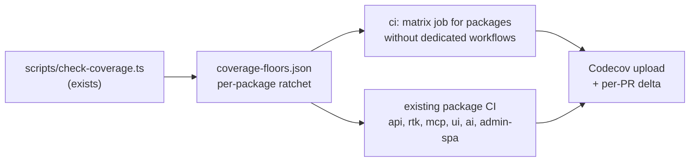

# Implementation Plan: Examples, Demo, and Test Coverage

**Status:** Draft — blocking questions open
**Priority:** Medium
**Effort:** Big batch
**Owner:** unassigned
**Created:** 2026-07-27
**Program:** [OSS launch](oss-launch-program.md)
**Depends on:** [`docs-reference-coverage`](docs-reference-coverage.md) (demo README)
**RTK deprecation flag:** **Partial** — example-app tasks touch the data layer and are `[RTK]` marked. The demo app is `@terreno/ui`-only and has no data layer, so its tasks are safe now.

## Goal

Close the credibility gaps a prospective adopter checks before trusting a framework: does the component library have visible examples, are the claimed features actually exercised, and does CI enforce the quality bar the project claims.

Three concrete problems today:

1. **The demo app covers roughly 58 of the library's components.** Notable omissions include `GPTChat`, `ActionSheet`, `SplitPage`, `SocialLoginButton`, `DraggableList`, `FilePickerButton`, `Image`, `ModalSheet`, and `UpgradeRequiredScreen`. A component with no visible example is a component people assume is broken. `demo/package.json`'s `test:ci` is `echo 'No tests'`.
2. **Coverage gates are enforced unevenly.** `api`, `rtk`, and `mcp-server` CI enforce the 95% threshold via `scripts/check-coverage.ts`. `ui`, `ai`, `admin-backend`, `admin-frontend`, `admin-spa`, `feature-flags`, and `api-health` have `test:coverage` scripts but no CI job enforcing them. Three published packages have no dedicated CI workflow at all.
3. **No public coverage signal.** No badge, no Codecov, so the claim "well tested" is unverifiable from outside.

## Non-Goals

- Raising coverage thresholds.
- Writing tests for every uncovered line (the daily test-improver workflow already chips at this).
- Building a fourth example app.
- Visual regression testing.

## Blocking questions

| # | Question | Options | Recommended default (pending confirmation) |
|---|----------|---------|--------------------------------------------|
| E1 | Do we require a demo story for every `@terreno/ui` component? | (A) Yes, CI-enforced. (B) Yes for exported components, allowlist for internals. (C) Recommended only. | **B** — CI-enforced against the export list with an explicit allowlist for components that genuinely cannot be demoed in isolation. Each allowlist entry needs a reason |
| E2 | Do we add a coverage badge / Codecov? | (A) Codecov with badges per package. (B) A self-hosted badge from CI. (C) No badge. | **A** — Codecov is free for public repos and gives per-PR coverage deltas, which is more useful than the badge |
| E3 | Do all published packages get dedicated CI? | (A) Yes, one workflow per published package. (B) One matrix workflow across packages without their own. | **B** — a matrix job for `admin-backend`, `feature-flags`, and `api-health` rather than three near-identical workflows. Fewer files to keep in sync |
| E4 | Do we enforce coverage on packages currently below threshold? | (A) Enforce immediately; failing packages must catch up first. (B) Ratchet: record current coverage as the floor, forbid decreases. | **B** — the ratchet. Blocking all work on packages that are behind is how coverage enforcement gets reverted |
| E5 | `[RTK]` Do example apps need a feature-parity checklist? | (A) Yes, a documented matrix of framework features versus example coverage. (B) No. | **A** — the repo already claims examples double as integration tests. A matrix makes that checkable and shows which features have no working example |

## Architecture

### Demo story coverage

`demo/` is an Expo Router app where each component demo is a story in `demo/stories/*.stories.tsx` registered in `demoConfig.tsx`. Adding coverage means adding stories and registering them.

The enforcement mechanism: a script that reads the export list from `ui/src/index.tsx`, reads the registered stories from `demoConfig.tsx`, and fails when an exported component has neither a story nor an allowlist entry. Run in `ui-demo-ci.yml`.

Priority for the missing stories — highest-visibility first:

| Priority | Components | Why |
|----------|-----------|-----|
| P0 | `GPTChat`, `SocialLoginButton`, `SplitPage` | Directly demonstrate the AI and auth pillars and the responsive web layout |
| P1 | `ActionSheet`, `ModalSheet`, `FilePickerButton`, `Image` | Common in real apps |
| P2 | `DraggableList`, `UpgradeRequiredScreen`, remaining gaps | Less common |

Derive the actual missing list from the export list at implementation time rather than trusting this table.

### Coverage enforcement

The ratchet file records each package's current coverage as its floor. CI fails on a decrease. The daily test-improver workflow raises floors over time.

### Example app feature matrix

The repo states that `example-frontend` and `example-backend` serve as documentation and integration tests. That is only true if it is checked. A matrix in `docs/explanation/example-coverage.md` maps each framework capability to whether an example exercises it:

| Capability | example-backend | example-frontend | Gap |
|------------|-----------------|------------------|-----|
| `modelRouter` CRUD | yes | yes | — |
| Owner permissions | yes | yes | — |
| Admin panel (embedded) | yes | yes | — |
| Admin SPA | yes | n/a | — |
| AI streaming chat | yes | yes | — |
| AI structured output | ? | ? | verify |
| Feature flags + live updates | yes | yes | — |
| Websockets / realtime | yes | yes | — |
| Consent forms | yes | yes | — |
| File upload / GCS | yes | yes | — |
| Better Auth | ? | ? | verify |
| syncdb local-first | (from #869) | (from #869) | verify after merge |
| RBAC | no | no | not shipped |
| Background jobs | no | no | not shipped |

Every `?` must be resolved by reading the example source, and every real gap either filled or recorded as a known gap.

## Models / APIs / Notifications

None.

## UI

New demo stories only. No changes to `@terreno/ui` components except bug fixes discovered while writing stories — which is a common and welcome side effect.

## Phases

1. **Demo coverage** — audit, P0 stories, then the enforcement check.
2. **Remaining demo stories** — P1 and P2.
3. **Coverage ratchet** — floors file, matrix CI job, wire the missing packages.
4. **Codecov** — upload and badges.
5. **Example feature matrix** — audit and fill or record gaps.

## Feature Flags & Migrations

None. Introducing the ratchet requires generating the initial floors from a full test run on `master` so the baseline is honest rather than aspirational.

## Not Included / Future Work

- Visual regression / screenshot testing of the demo.
- Raising coverage thresholds beyond current levels.
- Publishing the demo app to app stores.
- Consolidating the Appium and Maestro E2E suites.

## Files to Create / Modify

**Create**

- `demo/stories/*.stories.tsx` (the missing components)
- `scripts/check-demo-coverage.ts`
- `coverage-floors.json`
- `.github/workflows/packages-ci.yml` (matrix for packages without dedicated CI)
- `docs/explanation/example-coverage.md`
- `codecov.yml`

**Modify**

- `demo/demoConfig.tsx`
- `demo/package.json` (`test:ci` currently a no-op)
- `.github/workflows/ui-demo-ci.yml`, `ui-ci.yml`, `ai-ci.yml`, `admin-spa-ci.yml`
- `scripts/check-coverage.ts` (ratchet support)
- `README.md` (coverage badge)
- `CONTRIBUTING.md` (coverage expectations)

## Task List

See [`docs/tasks/examples-demo-coverage.md`](../tasks/examples-demo-coverage.md).

## Acceptance Criteria

- [ ] Every component exported from `ui/src/index.tsx` has a demo story or an allowlist entry with a stated reason.
- [ ] `bun run scripts/check-demo-coverage.ts` fails when a newly exported component has no story and no allowlist entry, and runs in `ui-demo-ci.yml`.
- [ ] `demo/package.json`'s `test:ci` runs something real.
- [ ] Stories exist for all P0 components, each showing multiple states (default, loading, error, disabled) where applicable.
- [ ] `coverage-floors.json` records a floor per package generated from a real test run on `master`.
- [ ] CI fails when any package's coverage drops below its floor.
- [ ] Every published package is covered by CI running its tests and coverage check, either through a dedicated workflow or the matrix job.
- [ ] Codecov receives uploads from every package's CI and reports per-PR deltas.
- [ ] `README.md` shows a coverage badge that reflects reality.
- [ ] `docs/explanation/example-coverage.md` resolves every `?` in the capability matrix, and each real gap is either filled with an example or recorded as a known gap with an issue link.
- [ ] `CONTRIBUTING.md` states the coverage expectation and how the ratchet works.
- [ ] `bun run lint`, `bun run compile`, and the full test suite pass.
