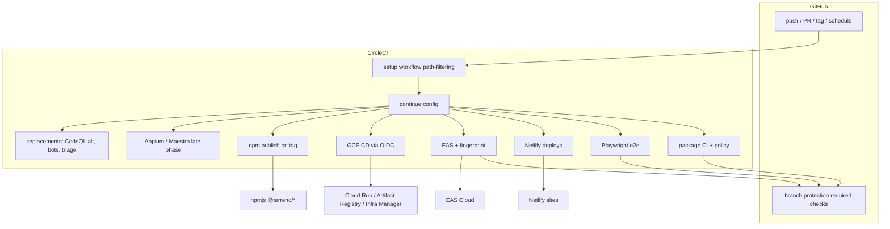

# Implementation Plan: Migrate CI/CD to CircleCI

**Status:** In progress — CI, release, Netlify/GCP production path deploys, and PR previews landed; EAS PR/fingerprint temporarily disabled; GitHub-native maintenance remains  
**Discussion:** _(none)_  
**Roadmap issue:** https://github.com/FlourishHealth/terreno/issues/1088
**Linear:** _(none)_  
**Priority:** High  
**Effort:** Large (cross-cutting infra; many workflows)  
**Owner:** unassigned (CircleCI org/plan: requester)  
**Created:** 2026-08-17  
**Branch:** `cursor/migrate-cicd-circleci-2b6d`  
**Research:** [`migrate-cicd-to-circleci-research.md`](migrate-cicd-to-circleci-research.md)  
**Depends on:** CircleCI org + paid plan created by requester; GCP project access for OIDC terraform  

## Goal

Move Terreno’s CI/CD from GitHub Actions to CircleCI end-to-end: every pipeline that builds, tests, deploys, publishes, or gates PRs runs on CircleCI. Use a dual-run cutover (GHA stays required until the matching CircleCI workflow is green, then delete the GHA workflow). End state: no `.github/workflows/*.yml` CI/CD jobs remain; GitHub keeps only what CircleCI cannot replace (if any residual is accepted, document it explicitly under Not Included).

## Non-Goals

- Changing what tests assert (only where they run), except for runner-parity fixes.
- Migrating sibling repos (Flourish, Zapling, etc.).
- Redesigning product deploy topology (Cloud Run / Netlify / EAS stay; only the orchestrator changes).
- Shipping Appium **iOS** on CircleCI in **v1** (deferred to a late phase; Android Appium may move earlier if ubuntu parity is easy).
- Rewriting gh-aw agentic *prompt* content; only re-home or replace the *runner*.

## Decisions

Recorded 2026-08-17 from Blend clarification.

| # | Question | Decision |
|---|----------|----------|
| CC1 | Scope | **A — Full cutover.** All CI/CD moves to CircleCI; GHA workflows deleted after dual-run proves green. |
| CC2 | Cutover style | **A — Dual-run.** Keep GHA required checks until the CircleCI twin is trusted, then remove GHA. |
| CC3 | v1 must include | **GCP CD + terraform**, **npm publish-on-tag**, **Netlify** (demo / example-frontend / docs), **EAS PR + fingerprint gate**. Not Appium iOS in v1. |
| CC4 | CircleCI account | Requester creates the CircleCI plan/org and links the GitHub repo. |
| CC5 | Branch protection | Remapping required checks is in scope; maintainers apply GitHub settings when CircleCI check names are stable. |
| CC6 | Config shape | **A — Dynamic config** (`setup: true`) + **path-filtering** orb. |

## Architecture

### Target topology



### Config layout

```
.circleci/
  config.yml              # setup: true — path-filtering only
  continue-config.yml     # all real workflows/jobs
  src/                    # optional: generated fragments if we split by package
```

- Use `circleci/path-filtering` to set boolean parameters (`run-api`, `run-ui`, `run-cd`, …) from changed paths (mirror today’s path filters).
- Use `circleci/node` orb (≥7.2.0) for Bun install + cache (`pkg-manager: bun`).
- Shared commands: `bun_install`, `start_mongo` (Docker service or `cimg` + mongo service), `compile_workspace_deps`.
- Prefer a **private org orb** later for reuse; v1 may inline commands in `continue-config.yml` to ship faster, then extract.

### Secrets: CircleCI Contexts

| Context | Contents (from current GHA) |
|---------|------------------------------|
| `terreno-npm` | `NPM_TOKEN` |
| `terreno-netlify` | `NETLIFY_AUTH_TOKEN`, site IDs |
| `terreno-expo` | `EXPO_TOKEN` |
| `terreno-gcp` | CircleCI OIDC (no long-lived key for CD); migrate `GCP_SA_KEY` off preview-cleanup onto OIDC |
| `terreno-e2e` | `E2E_TOKEN_SECRET`, `E2E_REFRESH_TOKEN_SECRET`, `E2E_SESSION_SECRET` |
| `terreno-release` | `REPO_ADMIN_TOKEN`, `ZOOM_WEBHOOK_URL`, `ZOOM_WEBHOOK_TOKEN` |
| `terreno-agentic` | `CURSOR_API_KEY` (and replacements for Copilot/gh-aw tokens if re-homed) |
| `terreno-github-api` | PAT with `pull-requests`, `deployments`, `contents` as needed for comments / Deployments API / roadmap |

Restrict context access by project + environment (e.g. `release` context only on tag workflows).

### GCP identity (blocking infra for Phase GCP)

Today `terraform/modules/github_oidc` trusts **only** `https://token.actions.githubusercontent.com`. CircleCI CD requires:

1. New Workload Identity pool provider for CircleCI’s OIDC issuer.
2. Attribute condition on org/project/VCS origin.
3. Bind `roles/iam.workloadIdentityUser` for deployer + terraform SAs.
4. Dual-trust during dual-run (GitHub + CircleCI providers both valid), then remove GitHub provider when GHA CD is deleted.

Prefer extending the module (`circleci_oidc` or rename to `ci_oidc` with multiple providers) over a one-off in Flourish terraform only — keep consumer docs honest.

### GitHub ↔ CircleCI integration

- CircleCI GitHub App (or OAuth) on `FlourishHealth/terreno`.
- Status checks reported to GitHub for branch protection (job names documented in `docs/explanation/repository-settings.md`).
- PR comments / labels / Deployments API: call GitHub REST via `gh` or `curl` with `terreno-github-api` context (replaces `GITHUB_TOKEN` action privileges).
- Tag + schedule triggers: CircleCI pipeline triggers (or GitHub → CircleCI API webhook) for cron jobs currently on GHA.

### Dual-run protocol (every phase)

1. Land CircleCI twin; name check `cci/<old-job-name>` or stable CircleCI job name.
2. Add CircleCI check as **non-required** optional signal; keep GHA required.
3. Observe green on `master` + representative PRs.
4. Flip branch protection: require CircleCI; unrequire GHA.
5. Delete the GHA workflow file in the same PR window as the protection flip (or immediately after).
6. Never leave tag publish listening on **both** systems.

## Models / APIs / Notifications / UI

None (infra-only). Zoom release notify stays a webhook call from the publish workflow.

## Phases

### Phase 0 — Prerequisites (human + docs)

- Create CircleCI org/plan; link repo; enable dynamic config.
- Create empty Contexts; document secret migration checklist.
- Inventory required check names vs today’s GHA job `name:` fields.

### Phase 1 — Foundation

- Add `.circleci/config.yml` + `continue-config.yml` skeleton.
- Path-filtering parameter map covering all packages + terraform + docs + demo.
- Shared Bun + cache + Mongo patterns.
- Smoke workflow on every push that only validates config.

### Phase 2 — Package CI + repo policy (v1)

Port and dual-run:

- `api-ci`, `ai-ci`, `rtk-ci`, `ui-ci`, `ui-demo-ci`, `comms-ci`, `mcp-server-ci`
- `example-frontend-ci`, `example-backend-ci`, `example-backend-script-runner`, `example-backend-docker`
- `admin-spa-ci`
- `repo-policies`, `rulesync-check`, `dco` (DCO via GitHub API + CircleCI)

### Phase 3 — Playwright E2E (v1)

- `e2e-ci`, `admin-spa-integration` (Mongo replica set + secrets context).

### Phase 4 — Netlify deploys (v1)

- `demo-deploy`, `frontend-example-deploy`, `docs-deploy`
- Recreate preview aliases + optional GitHub Deployments via API.
- `preview-cleanup` equivalent for Netlify/GCP previews as applicable.

Implemented: production jobs run on `master` from path filters; PR preview
jobs (`deploy-*-preview`, `gcp-cd-preview`) run on open PRs from this
repository. Matching GHA triggers stay `on: []`. Preview cleanup on PR close
remains a manual pipeline parameter.

### Phase 5 — EAS + fingerprint (v1)

- Port `eas-pr`, `eas-dev-build`, `fingerprint-gate` scripts under `.circleci/` or keep scripts in `.github/workflows/scripts/` and invoke from CircleCI until relocated to `scripts/ci/`.
- PR comment + `fingerprint-acknowledged` label via GitHub API.

Manual EAS dispatch is implemented. EAS PR updates and fingerprint
acknowledgement are retained with `on: []` until CircleCI comment/label parity
is implemented.

### Phase 6 — GCP CD + OIDC (v1)

- Terraform: CircleCI OIDC provider + dual-trust.
- Port `cd.yml` (detect → terraform → backend/mcp deploy).
- Port `preview-cleanup` onto OIDC (eliminate `GCP_SA_KEY`).
- Dual-run CD carefully (concurrency: one deployer).

Implemented as a single CircleCI writer with a CircleCI OIDC Terraform module.
Path filters start `gcp-cd-prod` on `master` and `gcp-cd-preview` on PRs.
Manual `run-cd` / `deploy-preview-pr` / `run-preview-cleanup` parameters remain.

### Phase 7 — npm publish (v1)

- Port `publish-on-tag` + `publish-feature-flags-manual`.
- **Single-writer rule:** disable GHA tag trigger in the same change that enables CircleCI tag pipeline.
- Keep Zoom notify + master version bump + docs cut + demo dispatch.

Implemented as a semver-tag release job plus manual `syncdb`/`feature-flags`
publishing. GHA publishing triggers are disabled. Docs version cutting remains
a follow-up; package publish, stable master bumps, Zoom notify, and demo deploy
are ported.

### Phase 8 — Mobile runners (post-v1 / still required for full cutover)

- Maestro web/Chrome (`maestro-e2e`) is implemented on CircleCI Linux browsers + Mongo replica set. GHA `maestro-e2e.yml` is `on: []`.
- Appium Android on Linux VM and Appium iOS on CircleCI macOS remain unported.

### Phase 9 — GitHub-native + agentic replacements (full cutover)

| Current GHA | Replacement approach |
|-------------|----------------------|
| `codeql-analysis` | CircleCI job uploading SARIF to GitHub Code Scanning API **or** third-party SAST orb; preserve Security tab if possible |
| `dependabot-auto-merge` | Keep Dependabot PRs on GitHub; auto-merge via CircleCI on Dependabot branches **or** Renovate on CircleCI |
| `triage.yml` | CircleCI pipeline trigger on `issues` via GitHub Apps webhook → CircleCI API, or GitHub Action **stub** only if product accepts residual GHA (conflicts with CC1 — prefer webhook) |
| `roadmap-generate` | Scheduled CircleCI job with `ROADMAP_PROJECT_TOKEN` |
| `architectural-pr-review` | Implemented: CircleCI job + `CURSOR_API_KEY` / `GITHUB_TOKEN`. Checks out `origin/master`, skips forks. GHA workflow is `on: []`. |
| Cursor Approval / Security / Bugbot | **Cannot move.** Cursor GitHub App automations, not repo workflows. |
| `agentics-maintenance` + `*.lock.yml` gh-aw | Re-home to CircleCI scheduled pipelines calling the same scripts **or** retire features; do not leave gh-aw as the only runner if CC1 holds |
| `docs-audit` | Scheduled CircleCI job |

### Phase 10 — Cleanup + docs

- Delete remaining `.github/workflows/*.yml` (and lock sources if retired).
- Update `CONTRIBUTING.md`, `docs/explanation/repository-settings.md`, `terraform/README.md`, deploy how-tos, AGENTS.md Cloud CI notes.
- Archive research; mark IP Complete.

## Feature Flags & Migrations

- No product feature flags.
- Infra migration: dual OIDC trust window; dual CI check window; **no dual tag-publish**.
- Secret migration checklist is the migration artifact (Contexts populated before jobs go required).

## Activity Log & User Updates

- Announce in Discord/Slack/Zoom when required checks flip and when tag publish moves.
- Changelog: under Unreleased chore — “CI/CD runs on CircleCI”.

## Not Included / Future Work

- Private orb publication + versioning pipeline (nice follow-up after Phase 1–2 stabilize).
- Moving Netlify sites to GCS+CDN (separate deploy architecture IPs).
- Self-hosted CircleCI runners.
- Credit-cost optimization beyond path-filtering (test splitting, resource-class tuning).

## Risks & Mitigations

| Risk | Mitigation |
|------|------------|
| Double npm publish | Single-writer cutover for tags; disable GHA first or in same commit |
| GCP deploy from wrong IdP | Dual-trust then remove GitHub provider; dry-run terraform preview on CircleCI first |
| Branch protection gaps during flip | Document exact check names; flip in a dedicated maintainer window |
| macOS/Appium flake | Deferred to Phase 8; keep GHA Appium until CircleCI macOS proven |
| gh-aw feature loss | Phase 9 explicit replace-or-retire decision per lockfile before deleting |
| Credit burn during dual-run | Path filters; timebox dual-run per phase (target: days, not months) |
| `mcp-server-ci` still filters `main` | Normalize to `master` while porting |

## Files to Create / Modify

**Create**

- `.circleci/config.yml`
- `.circleci/continue-config.yml`
- `docs/how-to/circleci.md` (or `docs/explanation/ci-cd-circleci.md`)
- `terraform/modules/circleci_oidc/` or extend `github_oidc` → multi-provider `ci_oidc`
- `scripts/ci/` (relocated EAS/fingerprint helpers)

**Modify**

- `docs/explanation/repository-settings.md`
- `terraform/README.md`, Flourish/terreno terraform roots that wire OIDC
- `CONTRIBUTING.md`, root/CI docs references to GitHub Actions
- Delete `.github/workflows/*` progressively per phase

## Task List

See [`docs/tasks/migrate-cicd-to-circleci.md`](../tasks/migrate-cicd-to-circleci.md).

## Acceptance Criteria

- [ ] All v1 workflows (package CI, policy, Playwright e2e, Netlify, EAS/fingerprint, GCP CD, npm publish) are green on CircleCI and required on `master` where applicable.
- [ ] Matching GHA workflows for those surfaces are deleted; tag publish has exactly one listener.
- [ ] CircleCI OIDC can deploy Cloud Run without `GCP_SA_KEY` for CD paths.
- [ ] Path-filtering skips unrelated package jobs on a docs-only change.
- [ ] `repository-settings.md` lists CircleCI check names; branch protection matches.
- [ ] Phase 8–9 either complete (full cutover) or are tracked as blocking follow-ups before calling CC1 done.
- [ ] CONTRIBUTING / terraform / deploy docs no longer instruct maintainers to use GHA for Terreno CI/CD.
