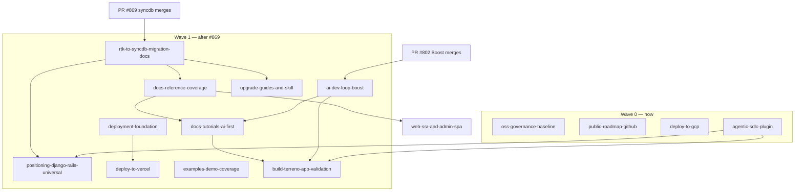

# Program: Open Source Launch

**Status:** In progress — decisions recorded (defaults accepted 2026-07-29)
**Roadmap issue:** https://github.com/FlourishHealth/terreno/issues/1094
**Priority:** High
**Effort:** Epic (multiple IPs)
**Owner:** unassigned
**Created:** 2026-07-27

Umbrella program for taking Terreno from "internal Flourish monorepo that happens to publish npm packages" to a credible public open-source framework. This document is the index, sequencing plan, and single place where cross-IP decisions get recorded.

Individual IPs live alongside this file; each has a companion task list in `docs/tasks/`.

## Positioning

Every IP in this program must use one consistent positioning statement. The agreed framing:

> **Terreno is Django/Rails for TypeScript — with universal app support.**
>
> Batteries-included full-stack framework: models, migrations-free schema conventions, auto-generated REST APIs, permissions, admin panel, auth, and an AI service on the backend; one React Native codebase that ships to iOS, Android, and web on the frontend. Built to be driven by AI coding agents from the first prompt to production deploy.

Three pillars, in priority order:

1. **Batteries included** (the Django/Rails claim) — the undifferentiated 80% of an app is already written: auth, CRUD, admin, permissions, AI, realtime, feature flags, consent.
2. **Universal by default** (the differentiator vs Django/Rails) — one codebase, three platforms. Not a web framework with a mobile bolt-on.
3. **AI-native** (the differentiator vs everything) — two layers, and the docs must present them as complementary:
   - the **tool layer**: an MCP server with codegen, docs search, and runtime introspection (logs, client state, navigation), plus per-package agent guidelines;
   - the **process layer**: the `/terreno-*` lifecycle shipped as an installable plugin —
     shape, implement test-first, verify in a fresh context, submit with evidence, then
     react once per current PR state while an outer loop owns waiting and reinvocation.

   Agents are a first-class client of the framework, not an afterthought. Django gives you `manage.py startapp`; Terreno gives you a reviewed path from a request to a mergeable PR.

Language rules for all docs:

- Say "Django/Rails for TypeScript" in the first two sentences of the README and docs landing page.
- Say "universal app" (not "cross-platform", not "React Native app") when describing the frontend.
- Never claim features listed under "Where Terreno is headed" as shipped.
- Avoid "the best framework for X" superlatives in reference docs; keep those to the landing page.

## RTK deprecation gate

**`@terreno/rtk` is being replaced.** PR [#869](https://github.com/flourishhealth/terreno/pull/869) (`@terreno/syncdb` local-first data layer) makes **Better Auth + `@terreno/syncdb`** the supported frontend platform. RTK Query becomes legacy.

**Program-wide rule: IPs flagged `Blocked` may not be implemented until #869 merges.** Writing docs against RTK now guarantees a rewrite. Planning (this program) proceeds; implementation of `None`-flagged IPs may start before #869; `Partial` IPs proceed except for `[RTK]`-marked tasks.

Each IP carries an explicit flag:

| Flag | Meaning |
|------|---------|
| **None** | No RTK/Better Auth surface. Safe to implement before #869. |
| **Partial** | Mostly RTK-independent, but specific tasks touch RTK. Those tasks are marked `[RTK]` in the task file. |
| **Blocked** | Core content is RTK-shaped. Do not start until #869 merges. |

Every `[RTK]`-marked task in every task file must be reviewed against the merged #869 surface before implementation. The migration content itself is owned by [`rtk-to-syncdb-migration-docs.md`](rtk-to-syncdb-migration-docs.md), which gates most of Wave 1.

### Known RTK-shaped surfaces to re-verify after #869

| Surface | Location | Post-#869 expectation |
|---------|----------|-----------------------|
| Frontend data-fetching narrative | `README.md`, `docs/README.md`, `docs/tutorials/getting-started.md` | syncdb local-first reads/mutations |
| SDK codegen loop | `.rulesync/skills/generate-sdk/SKILL.md`, `example-frontend/openapi-config.ts` | `@terreno/syncdb-codegen` descriptors |
| Auth story | `docs/how-to/configure-better-auth.md`, `docs/explanation/authentication.md` | Better Auth primary, JWT legacy |
| `docs/reference/rtk.md` | reference tree | **Removed from launch reference** (P7 A); migration guide only |
| `get_rtk_state` MCP tool | `mcp-server/src/local/tools/runtime.ts` (PR #802) | Rename/extend to syncdb store inspection |
| `installTerrenoDevConsoleLogger` | `rtk/src/devConsoleLogger.ts` (PR #802) | Move to syncdb or a shared client package |
| Feature-flag client hooks | `docs/reference/feature-flags.md`, `rtk/src/` | OpenFeature provider fed by syncdb |
| Offline queue | `rtk/src/` offline middleware | Superseded by syncdb outbox |

## Boost dependency (AI story)

PR [#802](https://github.com/flourishhealth/terreno/pull/802) (MCP Boost parity, Phases 4–6) is **assumed merged** by the AI-facing IPs. It delivers the runtime half of the AI story:

- `read_logs` merging backend / app (CDP) / Metro / browser sources
- `last_error` across sources
- `get_rtk_state` (→ syncdb state post-#869)
- `evaluate` and `navigate` over CDP, gated by `TERRENO_MCP_EVAL=1`
- Dev-only `POST /__terreno/browser-logs` ingestion in `@terreno/api`

Combined with the already-shipped hosted tools (`terreno_search_docs`, `terreno_get_component_docs`, `terreno_bootstrap_app`, generators, `terreno_get_upgrade_guide`), this is the "agent can build, run, observe, and fix a Terreno app without a human reading logs" claim. [`ai-dev-loop-boost.md`](ai-dev-loop-boost.md) owns telling that story.

## The `/terreno-*` SDLC pipeline

The repo already ships the process half of the AI story: `.cursor-plugin/marketplace.json`
plus `plugins/terreno-planning/` define five bounded transitions —
**`/terreno-1-grow`** (shape), **`/terreno-2-pick`** (build),
**`/terreno-3-roast`** (prove), **`/terreno-4-brew`** (submit), and
**`/terreno-5-taste`** (react once). The outer loop owns persistence, waiting, retry, and
escalation. Former command names are a documented hard-cut migration — see
[`agentic-sdlc-plugin.md`](agentic-sdlc-plugin.md).

It encodes real judgment rather than automation: a question-first planning gate that refuses to commit to decisions before they are answered, independent review and test-quality sub-agents spawned in **fresh contexts** after every commit, drift detection against the plan, anti-mocking rules, a hard frontend-evidence gate, and a refusal to push speculative fixes for flaky CI.

Two problems block using it as a launch asset, both owned by [`agentic-sdlc-plugin.md`](agentic-sdlc-plugin.md):

1. **It is invisible.** No `plugins/README.md`, no docs page, no mention in `README.md` or `AGENTS.md`. The audit that produced this program missed it entirely — which is exactly what every prospective user will do.
2. **It only works inside this monorepo.** Repo-root-relative sibling-skill paths, a dependency on a `verify-ui-changes` skill that lives in `.rulesync/`, hardcoded monorepo package names in the frontend gates, and a hardcoded branch suffix. Publishing it without fixing these ships tooling that breaks on first use in a consumer app.

## IP index

### Wave 0 — unblocked, can start immediately

| IP | Title | RTK flag | Why now |
|----|-------|----------|---------|
| [oss-governance-baseline](oss-governance-baseline.md) | License, contributing, security, changelog, templates | None | Legal blocker for any public launch; zero framework surface |
| [public-roadmap-github](public-roadmap-github.md) | GitHub Discussions + Projects roadmap + Linear bridge | None | Needed before inviting outside contributors; process-only |
| [deploy-to-gcp](deploy-to-gcp.md) | Generalized GCP deploy docs + `deploy-gcp` skill | None | Backend + static hosting only; no client data layer |
| [agentic-sdlc-plugin](agentic-sdlc-plugin.md) | Publish, port, and document the `/terreno-*` pipeline | Partial | Already built and shipping; only the frontend path lists touch the data layer |

### Wave 1 — gated on #869 (syncdb) merging

| IP | Title | RTK flag | Depends on |
|----|-------|----------|------------|
| [rtk-to-syncdb-migration-docs](rtk-to-syncdb-migration-docs.md) | Deprecation policy, migration guide, reference restructure | Blocked | #869 |
| [positioning-django-rails-universal](positioning-django-rails-universal.md) | Positioning rewrite across README, docs site, agent rules | Partial | rtk-to-syncdb-migration-docs |
| [docs-reference-coverage](docs-reference-coverage.md) | `ai.md`, `syncdb.md`, `admin-spa.md`, de-stub package READMEs | Blocked | rtk-to-syncdb-migration-docs |
| [docs-tutorials-ai-first](docs-tutorials-ai-first.md) | Getting-started rewrite + 4 new tutorials | Blocked | docs-reference-coverage, ai-dev-loop-boost |
| [deployment-foundation](deployment-foundation.md) | Deployment architecture, env reference, backend Dockerfile | Partial | — |
| [deploy-to-vercel](deploy-to-vercel.md) | Vercel deploy docs + `deploy-vercel` skill | Partial | deployment-foundation |
| [upgrade-guides-and-skill](upgrade-guides-and-skill.md) | `upgrading-terreno` skill, backfill 0.22–0.26 notes, release gate | Blocked | rtk-to-syncdb-migration-docs |
| [ai-dev-loop-boost](ai-dev-loop-boost.md) | AI-native story built on Boost #802 | Partial | #802 |
| [build-terreno-app-validation](build-terreno-app-validation.md) | `build-terreno-app` skill run + blog post | Blocked | docs-tutorials-ai-first, ai-dev-loop-boost |
| [examples-demo-coverage](examples-demo-coverage.md) | Demo README, missing stories, CI coverage gates | Partial | — |

### Wave 2 — independent feature work

| IP | Title | RTK flag | Notes |
|----|-------|----------|-------|
| [web-ssr-and-admin-spa](web-ssr-and-admin-spa.md) | Server-side rendering for universal web + admin-spa migration | Partial | Can be planned/prototyped in parallel; ships after Wave 1 docs stabilize |

## Suggested sequencing

Launch gate: Wave 0 complete **and** `rtk-to-syncdb-migration-docs`, `positioning-django-rails-universal`, `docs-reference-coverage`, `docs-tutorials-ai-first`, `deploy-to-vercel`, `deploy-to-gcp`, `upgrade-guides-and-skill` complete. `build-terreno-app-validation` is the acceptance test for the whole program — if an agent following only public docs and skills cannot build and deploy the demo app, the launch is not ready.

`agentic-sdlc-plugin` feeds two others: it supplies the process half of the AI-native pillar to `positioning-django-rails-universal`, and once public it becomes something the dogfooding harness in `build-terreno-app-validation` should exercise.

## Blocking questions (program level)

**Recorded 2026-07-29** (defaults accepted for all unspecified items).

| # | Question | Decision |
|---|----------|----------|
| P1 | License for the whole monorepo | **MIT everywhere** — relicense `api`/`ui` from Apache-2.0; align `@terreno/mcp` and all published packages |
| P2 | Copyright / governance model | **B** — Flourish + **DCO** sign-off (`Signed-off-by` on external PRs) |
| P3 | Public support channel | **A** — GitHub Discussions only at launch |
| P4 | Hosted MCP URL | **`https://mcp.terreno.app`** — retire `mcp.terreno.flourish.health` before launch |
| P5 | Flourish-specific infra in the public repo | **C now** — move under `infra/flourish/`; **note to migrate to B** (private repo, generic modules only) post-launch |
| P6 | Publish `@terreno/rtk` after #869 | **A** — keep publishing with deprecation notice through the current major line; **stop publishing in the next major** |
| P7 | Launch documentation stack | **A** — **syncdb + Better Auth only** in tutorials, reference, and positioning (no parallel RTK/JWT path in public docs) |
| P8 | Docs site versioning at launch | **B** — latest + one previous major |
| P9 | Target npm version for launch | **C** — stay on 0.x; launch on **`0.56.x`** aligned with Expo SDK 56; promise 1.0 after syncdb stabilizes |
| P10 | Blog post venue | **A** — docs site blog only |
| P11 | `/terreno-*` SDLC plugin marketplace | **A** — public at launch, gated on portability work in [`agentic-sdlc-plugin.md`](agentic-sdlc-plugin.md) |

**Brand / domain:** public surfaces use **`terreno.app`** (MCP at `mcp.terreno.app`, contacts at `@terreno.app`).

Per-IP blocking questions live in each IP file under `## Blocking questions`.

## Not included / future work

- **Vercel deployment topology spike** — whether `@terreno/api` (Socket.io, change streams, SSE) can run on Vercel in one platform with the web app and file storage, or whether a split host remains required. Tracked as open TODOs in [`deploy-to-vercel.md`](deploy-to-vercel.md); do not document a finalized topology until the spike lands.
- Actual 1.0 API-stability audit.
- Trademark/brand review of the "Terreno" name.
- Paid support, sponsorship, or OpenCollective setup.
- Conference talks / launch-day marketing beyond the blog post.
- Migrating internal Flourish apps onto syncdb (tracked separately from the OSS launch).
