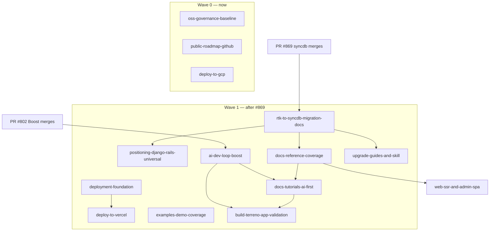

# Program: Open Source Launch

**Status:** Draft — blocking questions open
**Priority:** High
**Effort:** Epic (multiple IPs)
**Owner:** unassigned
**Created:** 2026-07-27

Umbrella program for taking Terreno from "internal Flourish monorepo that happens to publish npm packages" to a credible public open-source framework. This document is the index, sequencing plan, and single place where cross-IP decisions get recorded.

Individual IPs live alongside this file; each has a companion task list in `docs/tasks/`.

## Positioning

Every IP in this program must use one consistent positioning statement. The agreed framing:

> **Terreno is Django/Rails for TypeScript — with universal app support.**
>
> Batteries-included full-stack framework: models, migrations-free schema conventions, auto-generated REST APIs, permissions, admin panel, auth, and an AI service on the backend; one React Native codebase that ships to iOS, Android, and web on the frontend. Built to be driven by AI coding agents from the first prompt to production deploy.

Three pillars, in priority order:

1. **Batteries included** (the Django/Rails claim) — the undifferentiated 80% of an app is already written: auth, CRUD, admin, permissions, AI, realtime, feature flags, consent.
2. **Universal by default** (the differentiator vs Django/Rails) — one codebase, three platforms. Not a web framework with a mobile bolt-on.
3. **AI-native** (the differentiator vs everything) — MCP server with codegen + runtime introspection, per-package agent guidelines, skills for build/deploy/upgrade. Agents are a first-class client of the framework, not an afterthought.

Language rules for all docs:

- Say "Django/Rails for TypeScript" in the first two sentences of the README and docs landing page.
- Say "universal app" (not "cross-platform", not "React Native app") when describing the frontend.
- Never claim features listed under "Where Terreno is headed" as shipped.
- Avoid "the best framework for X" superlatives in reference docs; keep those to the landing page.

## RTK deprecation gate

**`@terreno/rtk` is being replaced.** PR [#869](https://github.com/flourishhealth/terreno/pull/869) (`@terreno/syncdb` local-first data layer) makes **Better Auth + `@terreno/syncdb`** the supported frontend platform. RTK Query becomes legacy.

**Program-wide rule: no documentation IP in this program may be implemented until #869 merges.** Writing docs against RTK now guarantees a rewrite. Planning (this program) proceeds; implementation waits.

Each IP carries an explicit flag:

| Flag | Meaning |
|------|---------|
| **None** | No RTK/Better Auth surface. Safe to implement before #869. |
| **Partial** | Mostly RTK-independent, but specific tasks touch RTK. Those tasks are marked `[RTK]` in the task file. |
| **Blocked** | Core content is RTK-shaped. Do not start until #869 merges. |

Every `[RTK]`-marked task in every task file must be reviewed against the merged #869 surface before implementation. The migration content itself is owned by [`rtk-to-syncdb-migration-docs.md`](rtk-to-syncdb-migration-docs.md), which gates most of Wave 1.

### Known RTK-shaped surfaces to re-verify after #869

| Surface | Location | Post-#869 expectation |
|---------|----------|-----------------------|
| Frontend data-fetching narrative | `README.md`, `docs/README.md`, `docs/tutorials/getting-started.md` | syncdb local-first reads/mutations |
| SDK codegen loop | `.rulesync/skills/generate-sdk/SKILL.md`, `example-frontend/openapi-config.ts` | `@terreno/syncdb-codegen` descriptors |
| Auth story | `docs/how-to/configure-better-auth.md`, `docs/explanation/authentication.md` | Better Auth primary, JWT legacy |
| `docs/reference/rtk.md` | reference tree | Becomes legacy page + new `syncdb.md` |
| `get_rtk_state` MCP tool | `mcp-server/src/local/tools/runtime.ts` (PR #802) | Rename/extend to syncdb store inspection |
| `installTerrenoDevConsoleLogger` | `rtk/src/devConsoleLogger.ts` (PR #802) | Move to syncdb or a shared client package |
| Feature-flag client hooks | `docs/reference/feature-flags.md`, `rtk/src/` | OpenFeature provider fed by syncdb |
| Offline queue | `rtk/src/` offline middleware | Superseded by syncdb outbox |

## Boost dependency (AI story)

PR [#802](https://github.com/flourishhealth/terreno/pull/802) (MCP Boost parity, Phases 4–6) is **assumed merged** by the AI-facing IPs. It delivers the runtime half of the AI story:

- `read_logs` merging backend / app (CDP) / Metro / browser sources
- `last_error` across sources
- `get_rtk_state` (→ syncdb state post-#869)
- `evaluate` and `navigate` over CDP, gated by `TERRENO_MCP_EVAL=1`
- Dev-only `POST /__terreno/browser-logs` ingestion in `@terreno/api`

Combined with the already-shipped hosted tools (`terreno_search_docs`, `terreno_get_component_docs`, `terreno_bootstrap_app`, generators, `terreno_get_upgrade_guide`), this is the "agent can build, run, observe, and fix a Terreno app without a human reading logs" claim. [`ai-dev-loop-boost.md`](ai-dev-loop-boost.md) owns telling that story.

## IP index

### Wave 0 — unblocked, can start immediately

| IP | Title | RTK flag | Why now |
|----|-------|----------|---------|
| [oss-governance-baseline](oss-governance-baseline.md) | License, contributing, security, changelog, templates | None | Legal blocker for any public launch; zero framework surface |
| [public-roadmap-github](public-roadmap-github.md) | GitHub Discussions + Projects roadmap + Linear bridge | None | Needed before inviting outside contributors; process-only |
| [deploy-to-gcp](deploy-to-gcp.md) | Generalized GCP deploy docs + `deploy-gcp` skill | None | Backend + static hosting only; no client data layer |

### Wave 1 — gated on #869 (syncdb) merging

| IP | Title | RTK flag | Depends on |
|----|-------|----------|------------|
| [rtk-to-syncdb-migration-docs](rtk-to-syncdb-migration-docs.md) | Deprecation policy, migration guide, reference restructure | Blocked | #869 |
| [positioning-django-rails-universal](positioning-django-rails-universal.md) | Positioning rewrite across README, docs site, agent rules | Partial | rtk-to-syncdb-migration-docs |
| [docs-reference-coverage](docs-reference-coverage.md) | `ai.md`, `syncdb.md`, `admin-spa.md`, de-stub package READMEs | Blocked | rtk-to-syncdb-migration-docs |
| [docs-tutorials-ai-first](docs-tutorials-ai-first.md) | Getting-started rewrite + 4 new tutorials | Blocked | docs-reference-coverage, ai-dev-loop-boost |
| [deployment-foundation](deployment-foundation.md) | Deployment architecture, env reference, backend Dockerfile | Partial | — |
| [deploy-to-vercel](deploy-to-vercel.md) | Vercel deploy docs + `deploy-vercel` skill | Partial | deployment-foundation |
| [upgrade-guides-and-skill](upgrade-guides-and-skill.md) | `upgrading-terreno` skill, backfill 0.22–0.26 notes, release gate | Blocked | rtk-to-syncdb-migration-docs |
| [ai-dev-loop-boost](ai-dev-loop-boost.md) | AI-native story built on Boost #802 | Partial | #802 |
| [build-terreno-app-validation](build-terreno-app-validation.md) | `build-terreno-app` skill run + blog post | Blocked | docs-tutorials-ai-first, ai-dev-loop-boost |
| [examples-demo-coverage](examples-demo-coverage.md) | Demo README, missing stories, CI coverage gates | Partial | — |

### Wave 2 — independent feature work

| IP | Title | RTK flag | Notes |
|----|-------|----------|-------|
| [web-ssr-and-admin-spa](web-ssr-and-admin-spa.md) | Server-side rendering for universal web + admin-spa migration | Partial | Can be planned/prototyped in parallel; ships after Wave 1 docs stabilize |

## Suggested sequencing

Launch gate: Wave 0 complete **and** `rtk-to-syncdb-migration-docs`, `positioning-django-rails-universal`, `docs-reference-coverage`, `docs-tutorials-ai-first`, `deploy-to-vercel`, `deploy-to-gcp`, `upgrade-guides-and-skill` complete. `build-terreno-app-validation` is the acceptance test for the whole program — if an agent following only public docs and skills cannot build and deploy the demo app, the launch is not ready.

## Blocking questions (program level)

Per the `terreno-1-blend` workflow, these must be answered before the affected IPs move from Draft to Approved. Each has a **recommended default** that will be adopted only if explicitly approved.

| # | Question | Options | Recommended default |
|---|----------|---------|---------------------|
| P1 | Which license for the whole monorepo? | (A) Apache-2.0 everywhere, retag `@terreno/mcp` from MIT. (B) MIT everywhere, relicense `api`/`ui`. (C) Keep the split. | **A** — Apache-2.0 everywhere. Patent grant matters for a framework; `api`/`ui` already ship it; only `mcp-server` changes. |
| P2 | Copyright holder / governance model? | (A) Flourish Health single-vendor, no CLA. (B) Flourish + DCO sign-off. (C) CLA via CLA-assistant. | **B** — DCO is low-friction and gives provenance without CLA overhead. |
| P3 | Public support channel? | (A) GitHub Discussions only. (B) Discussions + Discord. (C) Discussions + Slack Connect. | **A** to start — Discussions only; revisit Discord after 50+ external users. Avoids an unstaffed chat room. |
| P4 | Is `mcp.terreno.flourish.health` the permanent hosted MCP URL? | (A) Keep. (B) Move to `mcp.terreno.dev` (or similar) before launch. (C) Keep + CNAME alias. | **B** — a `flourish.health` URL in every consumer's `.cursor/mcp.json` reads as internal infra. Needs a domain decision. |
| P5 | Does Flourish-specific infra (terraform for `flourish-terreno`, Cloud Run services, Netlify sites) stay in the public repo? | (A) Stay, documented as "our deployment". (B) Move to a private repo, publish generic modules only. (C) Stay but move under `infra/flourish/`. | **C** — cheapest, keeps CI working, makes the boundary obvious. |
| P6 | Do we publish `@terreno/rtk` after #869 merges? | (A) Keep publishing with a deprecation notice for N releases. (B) Freeze at last version, npm-deprecate immediately. (C) Keep indefinitely as a supported alternative. | **A** with N=3 minor releases — internal apps and Flourish need a migration window. |
| P7 | Which stack does the launch documentation show as *the* path? | (A) syncdb + Better Auth only. (B) syncdb primary, RTK/JWT in a "legacy" section. (C) Both equally. | **B** — one blessed path, legacy discoverable but clearly secondary. |
| P8 | Do we version the docs site per release at launch, or publish "latest" only? | (A) Keep current per-version snapshots. (B) Latest + one previous major. (C) Latest only until 1.0. | **B** — current versioned snapshots (0.23–0.26) are noise for new readers; keep latest + previous. |
| P9 | Target npm version for launch? | (A) Launch on current 0.x. (B) Cut 1.0.0 as the launch release. (C) Launch on 0.x, promise 1.0 after syncdb stabilizes. | **C** — 1.0 implies API stability we do not have while syncdb is new. |
| P10 | Is the blog post from `build-terreno-app-validation` published on the docs site, Flourish blog, or dev.to/Hashnode? | (A) Docs site blog. (B) Flourish engineering blog + canonical link. (C) All three, canonical on docs site. | **C** with canonical on the docs site — the docs site needs the SEO. |

Per-IP blocking questions live in each IP file under `## Blocking questions`.

## Not included / future work

- Actual 1.0 API-stability audit.
- Trademark/brand review of the "Terreno" name.
- Paid support, sponsorship, or OpenCollective setup.
- Conference talks / launch-day marketing beyond the blog post.
- Migrating internal Flourish apps onto syncdb (tracked separately from the OSS launch).
