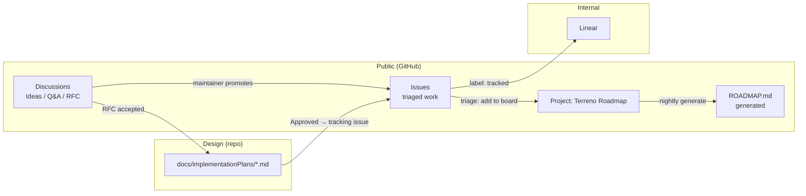

# Implementation Plan: Public Roadmap on GitHub

**Status:** Draft — blocking questions open
**Priority:** High
**Effort:** Small batch
**Owner:** unassigned
**Created:** 2026-07-27
**Program:** [OSS launch](oss-launch-program.md)
**Depends on:** [`oss-governance-baseline`](oss-governance-baseline.md) (issue templates land there)
**RTK deprecation flag:** None — process and metadata only. Safe to implement before PR #869.

## Goal

Run Terreno's roadmap in public on GitHub while keeping Linear as the internal execution tracker. Outside users need to see what is planned, argue about priorities, and file well-shaped requests; Flourish engineers need to keep sprinting in Linear without double-entry.

The design principle: **one direction of truth per artifact.** Public discussion and roadmap state live on GitHub. Sprint execution, estimates, and assignees live in Linear. IPs in `docs/implementationPlans/` remain the design source of truth for both.

## Non-Goals

- Migrating Flourish's internal work off Linear.
- Building a custom sync service between Linear and GitHub.
- Publishing internal Flourish product roadmap items that happen to touch Terreno.
- Public sprint planning or estimates.

## Blocking questions

| # | Question | Options | Recommended default (pending confirmation) |
|---|----------|---------|--------------------------------------------|
| R1 | Does the public roadmap show dates? | (A) No dates, ordered waves only. (B) Quarter granularity. (C) Target release version. | **C** — target release version (`0.28`, `0.29`, `Future`). Honest, no calendar promises, and it maps to lockstep releases. |
| R2 | Where does the roadmap live? | (A) GitHub Project board only. (B) `ROADMAP.md` only. (C) Project board as truth + generated `ROADMAP.md`. | **C** — the board is interactive, the markdown file is what people find from the README and docs site. Generate the file from the board. |
| R3 | Linear ↔ GitHub sync mechanism | (A) Manual cross-links. (B) Linear's native GitHub issue sync on labeled issues. (C) Custom GitHub Action. | **B** — Linear's GitHub integration on issues labeled `tracked`, one-way GitHub → Linear for intake, cross-link back via the Linear issue URL in a comment. |
| R4 | Who can open roadmap items? | (A) Maintainers only; users file Ideas discussions. (B) Anyone opens issues; maintainers triage onto the board. | **A** — Discussions are the intake funnel, issues are triaged work. Keeps the board meaningful. |
| R5 | Do IPs become public issues automatically? | (A) One tracking issue per IP, opened manually. (B) Automated from `PLAN_INDEX.md`. (C) IPs stay docs-only; issues reference them. | **A** — one tracking issue per IP, opened when the IP reaches Approved. Cheap, and gives a public comment thread per plan. |
| R6 | Are Discussions moderated pre- or post-publication? | (A) Open, post-moderated. (B) Require approval for first-time posters. | **A** — post-moderated with the Code of Conduct as the standard. Approval queues kill early momentum. |
| R7 | Do we run an RFC process for breaking changes? | (A) No, IPs suffice. (B) Lightweight RFC discussion category feeding an IP. (C) Full `rfcs/` directory with numbered proposals. | **B** — an `RFC` discussion category that graduates into an IP. Avoids a second parallel plan format. |

## Architecture

### Three surfaces, one flow

### Discussion categories

| Category | Format | Purpose | Who posts |
|----------|--------|---------|-----------|
| **Announcements** | Announcement | Releases, breaking changes, deprecations (including the RTK → syncdb deprecation), launch posts | Maintainers only |
| **Q&A** | Question / Answer | "How do I…" support questions. Answers marked accepted; recurring ones graduate into `docs/how-to/` | Anyone |
| **Ideas** | Open-ended | Feature requests before they are shaped. The intake funnel — nothing goes straight to an issue | Anyone |
| **RFCs** | Open-ended | Proposals that change public API or add a package. Graduates into an IP when accepted | Anyone, template-guided |
| **Show and tell** | Open-ended | Apps built with Terreno. Social proof, and a source of real-world friction reports | Anyone |
| **Agents & AI** | Open-ended | MCP setup, skills, agent workflows, prompt patterns. Deliberately separate — it is the differentiator and deserves a visible home | Anyone |
| **Docs feedback** | Open-ended | Per-page feedback; linked from every docs page footer | Anyone |

Category ordering in the UI should be: Announcements, Q&A, Ideas, Agents & AI, RFCs, Show and tell, Docs feedback.

### Project board

One org- or repo-level Project named **Terreno Roadmap**, board layout, grouped by `Status`.

**Fields**

| Field | Type | Values | Notes |
|-------|------|--------|-------|
| `Status` | single select | `Inbox`, `Shaping`, `Planned`, `In progress`, `In review`, `Shipped`, `Declined` | `Inbox` = triaged but not committed |
| `Area` | single select | `api`, `ui`, `syncdb`, `auth`, `admin`, `ai`, `mcp`, `docs`, `deploy`, `examples`, `dx` | Mirrors package boundaries plus cross-cutting areas |
| `Target` | single select | `0.28`, `0.29`, `Next`, `Future` | Per R1; add versions as releases approach |
| `IP` | text | e.g. `web-ssr-and-admin-spa` | Slug of the IP file, empty if no IP yet |
| `Impact` | single select | `Breaking`, `Feature`, `Improvement`, `Fix` | Drives changelog grouping |
| `Community interest` | number | 👍 count, refreshed on triage | Makes prioritization legible |

**Views**

1. **Roadmap** (board, grouped by `Status`, filtered to `Status != Declined`) — the default public view.
2. **By area** (table, grouped by `Area`) — for contributors looking for something to pick up.
3. **Next release** (table, filtered to `Target = <current+1>`) — what is actually landing.
4. **Needs shaping** (table, filtered to `Status = Shaping`) — where community input changes outcomes.

### Label taxonomy

Keep it small enough to be used consistently.

| Prefix | Labels | Purpose |
|--------|--------|---------|
| `area:` | `area:api`, `area:ui`, `area:syncdb`, `area:auth`, `area:admin`, `area:ai`, `area:mcp`, `area:docs`, `area:deploy`, `area:examples`, `area:dx` | Matches the `Area` project field |
| `type:` | `type:bug`, `type:feature`, `type:docs`, `type:chore`, `type:rfc` | Set by issue forms where possible |
| `status:` | `status:needs-triage`, `status:needs-info`, `status:blocked`, `status:wontfix` | Workflow state that is not board state |
| (bare) | `good first issue`, `help wanted`, `breaking`, `tracked`, `deprecation` | `tracked` triggers the Linear sync; `deprecation` marks RTK-migration work |

### Linear bridge

- Linear's GitHub integration is configured to import GitHub issues labeled `tracked` into the Terreno Linear team.
- Direction: GitHub → Linear for creation and title/description; status is **not** synced automatically. When a Linear issue closes, the engineer closes the GitHub issue in the same PR (`Fixes #NNN`), which moves the board to `Shipped`.
- Linear issues created internally that will become public work get a GitHub issue opened manually and the Linear URL pasted into it. No automation in that direction.
- Internal-only Linear work is never mirrored.

Rationale: two-way status sync between trackers reliably produces confusing loops. One-way intake plus `Fixes #NNN` on merge gives correct public state with no maintenance.

### Automation

Three GitHub Actions workflows:

1. **`roadmap-generate.yml`** — on a schedule and on Project item changes, query the Project via the GraphQL API and regenerate `ROADMAP.md` (grouped by `Target`, then `Area`, with links to issues and IPs). Commits only when the content changes.
2. **`triage.yml`** — on issue open: apply `status:needs-triage`, and apply the `area:*` label derived from the issue form's package dropdown.
3. **`discussion-to-issue.yml`** — optional; when a maintainer adds the `promote` label to a Discussion (or comments `/promote`), open a linked issue pre-filled from the discussion body. Skip in v1 if the GraphQL surface proves fiddly; manual promotion is acceptable.

## Models

None (GitHub metadata only).

## APIs

GitHub GraphQL API (`ProjectV2` queries) is used read-only by `roadmap-generate.yml`. Requires a token with `project: read` and `contents: write`; use the built-in `GITHUB_TOKEN` if org settings permit Projects access, otherwise a fine-grained PAT stored as a secret and validated at job start per the repo's required-secret-validation convention.

## Notifications

None beyond GitHub's own subscriptions. Announcements category posts should be the release channel; the `release` skill gains a step to post one for releases with breaking changes.

## UI

- `ROADMAP.md` at the repo root, linked from `README.md` and the docs site sidebar.
- A "Discuss this page" footer link on docs pages pointing at the Docs feedback category (implemented in the Docusaurus theme config).

## Phases

1. **Discussions** — enable, create categories, seed each with a pinned intro post, add the RFC template.
2. **Project board** — create the Project, fields, and views; backfill items from `PLAN_INDEX.md` and the IPs in this program.
3. **Labels and triage** — create the label set, delete unused defaults, add `triage.yml`.
4. **Roadmap generation** — `ROADMAP.md` + `roadmap-generate.yml`, link from README and docs site.
5. **Linear bridge** — configure the integration, document the process in `CONTRIBUTING.md`, and record the rules in a maintainer doc.

## Feature Flags & Migrations

None. Existing open issues need a one-time triage pass to apply the new labels and land on the board (Task 3.3).

## Activity Log & User Updates

None.

## Not Included / Future Work

- Public voting/prioritization beyond 👍 reactions.
- Automated changelog generation from board state.
- A status page or uptime dashboard for the hosted MCP server.
- Contributor recognition automation (all-contributors bot).

## Files to Create / Modify

**Create**

- `ROADMAP.md`
- `.github/DISCUSSION_TEMPLATE/rfc.yml`
- `.github/DISCUSSION_TEMPLATE/ideas.yml`
- `.github/workflows/roadmap-generate.yml`
- `.github/workflows/triage.yml`
- `docs/explanation/roadmap-process.md`
- `scripts/generate-roadmap.ts`

**Modify**

- `README.md` (link `ROADMAP.md` and Discussions)
- `CONTRIBUTING.md` (intake flow: Discussions → issue → board; RFC path)
- `website/docusaurus.config.ts` (docs feedback footer link, roadmap sidebar entry)
- `.rulesync/skills/release/SKILL.md` (post an Announcements discussion for breaking releases)
- `.github/ISSUE_TEMPLATE/*.yml` (add `type:` labels via the `labels:` key)

## Task List

See [`docs/tasks/public-roadmap-github.md`](../tasks/public-roadmap-github.md).

## Acceptance Criteria

- [ ] All seven Discussion categories exist with the specified formats and a pinned intro post each.
- [ ] The **Terreno Roadmap** Project exists with the six fields and four views described above.
- [ ] Every IP in `docs/implementationPlans/PLAN_INDEX.md` marked Approved or later has a tracking issue on the board with its `IP` field set to the IP slug.
- [ ] The label set matches the taxonomy table; no unused GitHub default labels remain.
- [ ] `bun run scripts/generate-roadmap.ts` produces `ROADMAP.md` grouped by `Target` then `Area`, and `roadmap-generate.yml` commits it only when changed.
- [ ] Opening a new issue applies `status:needs-triage` and the correct `area:*` label automatically.
- [ ] Adding `tracked` to a GitHub issue creates a corresponding Linear issue; closing the Linear issue does **not** silently change GitHub state.
- [ ] `CONTRIBUTING.md` documents the intake flow and the RFC path in under 30 lines.
- [ ] `docs/explanation/roadmap-process.md` explains the GitHub/Linear split, including why status is not two-way synced.
- [ ] Every docs page shows a working "Discuss this page" link.
