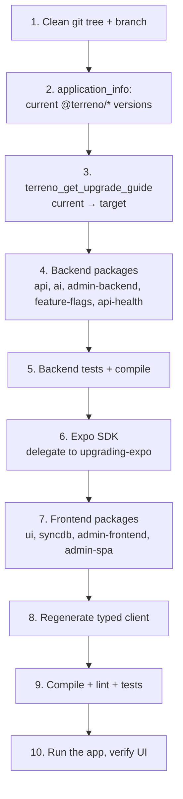

# Implementation Plan: Upgrade Guides and the `upgrading-terreno` Skill

**Status:** Draft — blocked on PR #869
**Roadmap issue:** https://github.com/FlourishHealth/terreno/issues/1013
**Priority:** High
**Effort:** Big batch
**Owner:** unassigned
**Created:** 2026-07-27
**Program:** [OSS launch](oss-launch-program.md)
**Depends on:** [`rtk-to-syncdb-migration-docs`](rtk-to-syncdb-migration-docs.md), [`oss-governance-baseline`](oss-governance-baseline.md) (changelog)
**RTK deprecation flag:** **Blocked** — the largest upgrade Terreno will ever ask consumers to perform is RTK → syncdb. The skill and the notes must be built around it.

## Goal

Make upgrading Terreno a solved problem before we ask the public to depend on it. The machinery is half-built: `terreno_get_upgrade_guide` exists and concatenates per-release notes, and a `terreno_upgrade` prompt exists — but only two upgrade notes have ever been written (`0.20.0.md`, `0.21.0.md`) against a current version of 0.26.0. Five releases have no notes, so the tool returns nothing useful for any recent range. There is no `upgrading-terreno` skill; the only upgrade skill in the repo is `upgrading-expo`, which handles the Expo SDK portion and nothing Terreno-specific.

An open-source framework that ships breaking changes in lockstep across eleven packages and cannot tell you what changed is not adoptable.

## Non-Goals

- Upgrading the Expo SDK (delegate to the existing `upgrading-expo` skill — do not duplicate its content).
- Automated codemods (see [`rtk-to-syncdb-migration-docs`](rtk-to-syncdb-migration-docs.md) question M6 — agent-assisted, not codemod).
- Changing the lockstep versioning scheme.
- Retroactively rewriting git history or release notes.

## Blocking questions

**Recorded 2026-07-29** (defaults accepted).

| # | Decision |
|---|----------|
| U1 | One consolidated **0.21 → 0.26** upgrade note; per-release notes from next version onward |
| U2 | Upgrade note required when changelog has **Deprecated / Removed / Changed** (CI-enforced) |
| U3 | Skill **performs** upgrade with confirmation gate + clean git tree |
| U4 | **Direct multi-version jump** with sequential fallback on failure |
| U5 | **Wrap `upgrading-expo`** at the correct point in the sequence |
| U6 | Publish **deprecation window policy** (≥3 minors until 1.0; align RTK sunset with program P6) |

## Architecture

### Three artifacts

1. **Upgrade notes** (`mcp-server/src/docs/upgrades/<version>.md`) — the data. Consumed by `terreno_get_upgrade_guide`, readable directly, and referenced from the changelog.
2. **The `upgrading-terreno` skill** — the executor. Wraps note application, dependency bumps, Expo delegation, codegen, and verification.
3. **A versioning and deprecation policy** (`docs/explanation/versioning-policy.md`) — the promise. What lockstep means, what a minor can break before 1.0, how long deprecations last.

### Upgrade note format

Standardize on the shape the existing notes already use, with required sections so the concatenated output from `terreno_get_upgrade_guide` reads coherently across several versions:

```markdown
# Upgrading to <version>

**Action required:** Yes | No
**Affected packages:** @terreno/api, @terreno/ui, ...

## Summary
## Breaking changes
### <change title>
**What changed** / **Why** / **Migration** (before/after code)
## Deprecations
## New capabilities
## Verification
```

The `Verification` section matters most for automation: it gives the skill a concrete way to confirm each version's upgrade succeeded before moving to the next.

### The upgrade ordering problem

Order is the thing consumers get wrong, and it is not obvious:



Backend first because the OpenAPI spec is the contract the frontend generates from; regenerating the client against an un-upgraded backend produces a client for the wrong API. Expo before the Terreno frontend packages because `@terreno/ui` pins peer dependencies against Expo's versions.

### Release-process enforcement

The `release` skill currently does not require an upgrade note. Add:

1. A required step: if the release's changelog section contains `Breaking`, `Deprecated`, `Removed`, or `Changed`, write `mcp-server/src/docs/upgrades/<version>.md` before tagging.
2. A CI check in `repo-policies.yml` that fails a release tag when the note is missing.

Without mechanical enforcement this decays again — that is exactly what happened between 0.21.0 and 0.26.0.

## Models / APIs

No new models. `terreno_get_upgrade_guide`'s behavior with a range containing no notes needs improving: it should say "no notes recorded for 0.22–0.24" rather than returning empty, so an agent does not conclude nothing changed.

## Notifications

An Announcements discussion post per breaking release, per [`public-roadmap-github`](public-roadmap-github.md) Task 5.3.

## UI

None.

## Phases

1. **Backfill** — the consolidated 0.21 → 0.26 note plus the note format and template.
2. **Policy** — `docs/explanation/versioning-policy.md`.
3. **Skill** — `upgrading-terreno` with the correct ordering and Expo delegation.
4. **Enforcement** — release skill step and CI check; improve the tool's empty-range response.
5. **Validation** — perform a real upgrade of a consumer app using only the skill.

## Feature Flags & Migrations

None.

## Not Included / Future Work

- Codemods.
- Automatic dependency-bump PRs (Dependabot covers third-party deps, not intra-Terreno lockstep bumps).
- A compatibility matrix across Expo SDK versions (worth doing once there is more than one supported SDK).
- Downgrade guidance.

## Files to Create / Modify

**Create**

- `mcp-server/src/docs/upgrades/README.md` (format + template)
- `mcp-server/src/docs/upgrades/0.26.0.md` (consolidated 0.21 → 0.26)
- `mcp-server/src/docs/upgrades/<syncdb-version>.md` (owned by the migration IP; referenced here)
- `docs/explanation/versioning-policy.md`
- `docs/how-to/upgrade-terreno.md`
- `.rulesync/skills/upgrading-terreno/SKILL.md`
- `.rulesync/skills/upgrading-terreno/references/ordering.md`

**Modify**

- `mcp-server/src/tools.ts` (`terreno_get_upgrade_guide` empty-range response)
- `mcp-server/src/prompts.ts` (`terreno_upgrade` prompt points at the skill)
- `.rulesync/skills/release/SKILL.md`
- `.github/workflows/repo-policies.yml`
- `CHANGELOG.md` (link notes per version)
- `docs/how-to/README.md`, `docs/explanation/README.md`

## Task List

See [`docs/tasks/upgrade-guides-and-skill.md`](../tasks/upgrade-guides-and-skill.md).

## Acceptance Criteria

- [ ] `mcp-server/src/docs/upgrades/README.md` defines the required note format with a template.
- [ ] A consolidated note covers everything a consumer must know to move from 0.21.0 to 0.26.0, derived from real release notes and diffs.
- [ ] `terreno_get_upgrade_guide` for the range 0.21.0 → current returns useful content, and for a range with no recorded notes returns an explicit "no notes recorded" message rather than empty output.
- [ ] `docs/explanation/versioning-policy.md` states what lockstep versioning means, the pre-1.0 breaking-change policy, and the minimum deprecation window.
- [ ] The `upgrading-terreno` skill exists with all mirrors committed and enforces a clean git tree before starting.
- [ ] The skill follows the documented ordering, delegates the Expo SDK portion to `upgrading-expo`, and regenerates the typed client only after the backend is upgraded.
- [ ] The skill runs compile, lint, and tests between phases and stops on first failure with the failing step named.
- [ ] On a multi-version jump failure, the skill retries version by version to isolate the breaking version.
- [ ] The release skill requires an upgrade note when the changelog section contains a breaking, deprecated, removed, or changed entry.
- [ ] A CI check fails a release tag whose upgrade note is missing when required.
- [ ] An upgrade of a real consumer app across at least two minor versions succeeds using only the skill, and the transcript is captured.
- [ ] `bun run mcp:build`, `bun run lint`, and `bun run rules:check` pass.
