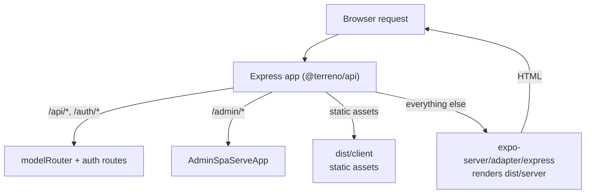

# Implementation Plan: Server-Side Rendering for Universal Web (and Admin SPA)

**Status:** Draft — blocking questions open
**Priority:** Medium
**Effort:** Epic
**Owner:** unassigned
**Created:** 2026-07-27
**Program:** [OSS launch](oss-launch-program.md) (Wave 2)
**Depends on:** Expo SDK ≥ 55 (PR [#779](https://github.com/flourishhealth/terreno/pull/779) upgrades to SDK 56), [`deployment-foundation`](deployment-foundation.md)
**RTK deprecation flag:** **Partial** — SSR interacts directly with the data layer. Server-rendered HTML needs data at render time, which is a fundamentally different question for a local-first client than for a request/response client. The data-loading design tasks are `[RTK]` marked and blocked on #869.

## Goal

Give Terreno's web target real server rendering, so a Terreno app can be indexed, shared with usable link previews, and load meaningful first paint without waiting for a JavaScript bundle. Then evaluate moving `@terreno/admin-spa` onto the same mechanism, since it is already served from Express and is the lowest-risk consumer.

The Django/Rails positioning makes this gap conspicuous: both frameworks server-render by default. Today Terreno's web output is `single` — a client-only SPA with one `index.html`, no per-route HTML, and no server rendering. For a framework claiming Django/Rails parity plus universal apps, "your web app is not indexable" is a real objection.

## Non-Goals

- Server-rendering native. SSR is web-only by definition.
- Replacing `@terreno/api` with Expo Router API routes. The backend stays the backend.
- React Server Components.
- Making SSR mandatory. It must be opt-in per app.
- Upgrading the Expo SDK (PR #779 owns that; this IP depends on it).

## Blocking questions

**Recorded 2026-07-29** (defaults accepted).

| # | Decision |
|---|----------|
| S1 | **`static` first, `server` later** (SSR alpha in Expo SDK 55+) |
| S2 | **`expo-server/adapter/express`** in `@terreno/api` as Terreno-native path; document per-provider adapters |
| S3 | **Shell-only SSR v1** — hydrate on client |
| S4 | **`admin-spa` moves to `static` output only** |
| S5 | **`static` becomes default eventually** (after component audit); `server` opt-in |
| S6 | **Expo Router API routes narrowly** for OG images / webhooks only |

## Architecture

### Where SSR fits

One Express process serves the API, the static client bundle, and server-rendered HTML. Route precedence matters: API and auth routes must match before the SSR catch-all, and the admin mount must not be shadowed.

### Risks specific to React Native Web SSR

This is where the work actually is, and where the estimate could be badly wrong:

| Risk | Detail | Mitigation |
|------|--------|------------|
| Components that touch browser APIs at module scope | `@terreno/ui` has ~100 components; any that read `window`, `localStorage`, or `Dimensions` during render or module init will throw during server rendering | Audit and fix; the repo already has SSR-safety precedent (`typeof window` checks in the client storage layer) |
| Fonts and styles | Nunito/Titillium Web loading and `react-native-web` style injection must produce correct first paint without a flash of unstyled content | Verify style extraction; may need explicit critical-CSS handling |
| Theme and provider hydration | `TerrenoProvider` computes a theme; server and client must agree or React logs hydration mismatches | Ensure deterministic theme resolution; no `Date.now()` or random values in the render path |
| Auth-dependent rendering | The server does not know who the user is without reading a session; rendering a logged-in shell then hydrating to logged-out causes visible flicker | v1: always render the unauthenticated shell (S3 option A) |
| Native-only dependencies | Packages that import native modules at the top level break the server bundle | Audit; use platform-specific extensions |
| Local-first client on the server | The syncdb client assumes IndexedDB and Web Crypto, neither of which exists on the server | The client must not initialize during server render; needs an explicit guard verified after #869 |

The last row is the one that could invalidate the plan, and it cannot be assessed until #869 merges. **Phase 0 exists to answer it before committing to the rest.**

### `admin-spa` as the proving ground

`@terreno/admin-spa` is an Expo Router web app already served from Express via `AdminSpaServeApp`. Moving it to `static` output is a contained experiment: no SEO requirement, one known consumer (`example-backend`), an existing integration test workflow (`admin-spa-integration.yml`), and an authenticated surface where the auth-flicker problem is bounded. If `static` output works there, the pattern generalizes.

## Models / APIs

No new models. `AdminSpaServeApp` gains options for the output mode and the server bundle path. Route precedence in `TerrenoApp`/`setupServer` may need an explicit ordering guarantee so the SSR catch-all cannot shadow API routes.

## Notifications

None.

## UI

No new components. Existing `@terreno/ui` components may need SSR-safety fixes — those are bug fixes, not features, and each needs a test that renders the component in a server-like environment without `window`.

## Phases

0. **Feasibility spike** — after SDK ≥ 55 and #869, attempt `static` output on `example-frontend` and record every failure. Decide go/no-go and correct this plan. **Do not proceed without this.**
1. **SSR-safety audit and fixes** — make `@terreno/ui` render without browser globals; add a server-render test harness.
2. **`static` output for `admin-spa`** — prove the pattern on the contained consumer.
3. **`static` output for `example-frontend`** — the reference implementation plus documentation.
4. **`server` output with the Express adapter** — SSR through `@terreno/api`, route precedence, deployment implications.
5. **Data loading design** — a separate design pass on `useLoaderData` versus local-first reconciliation. May become its own IP.
6. **Documentation and defaults** — how-to, explainer, and the decision on whether `static` becomes the default.

## Feature Flags & Migrations

- Output mode is per-app configuration in the Expo app config, not a runtime flag.
- `AdminSpaServeApp` must keep serving existing `single`-output builds so consumers upgrading Terreno without changing their admin build are unaffected.
- Changing the recommended default (S5) is a breaking change for consumers who copied the bootstrap config; it needs an upgrade note.

## Not Included / Future Work

- React Server Components.
- Streaming SSR.
- Incremental static regeneration.
- Server-rendering authenticated, personalized content (depends on Phase 5).
- Edge-runtime adapters (`workerd`, Netlify Edge) — the adapters exist upstream; document them once the Express path is proven.

## Files to Create / Modify

**Create**

- `docs/how-to/enable-web-ssr.md`
- `docs/explanation/web-rendering-modes.md`
- `ui/src/__tests__/serverRender.test.tsx` (server-render harness)
- `admin-spa/app.config.ts` changes plus a server entry if `server` output is adopted

**Modify**

- `example-frontend/app.json` (output mode)
- `admin-spa/app.json` / `app.config.ts`
- `admin-spa/src/**` (SSR-unsafe code)
- `ui/src/**` (SSR-safety fixes)
- `api/src/adminSpaServeApp.ts` (or wherever `AdminSpaServeApp` lives — confirm the path) for output-mode support
- `api/src/expressServer.ts` / `terrenoApp.ts` (route precedence)
- `docs/explanation/deployment-baseline.md` (update the output-mode table)
- `.github/workflows/admin-spa-integration.yml`

## Task List

See [`docs/tasks/web-ssr-and-admin-spa.md`](../tasks/web-ssr-and-admin-spa.md).

## Acceptance Criteria

- [ ] The Phase 0 spike produced a written feasibility report listing every failure encountered with `static` output, and an explicit go/no-go with this plan corrected accordingly.
- [ ] Every `@terreno/ui` component renders in a server-like environment without `window`, `document`, or `localStorage`, verified by an automated test.
- [ ] `admin-spa` builds and serves correctly with `static` output through `AdminSpaServeApp`, and `admin-spa-integration.yml` passes.
- [ ] `AdminSpaServeApp` still serves an existing `single`-output build unchanged.
- [ ] `example-frontend` builds with `static` output, produces per-route HTML, and every route returns HTML containing meaningful content (verified by fetching a route with JavaScript disabled).
- [ ] No React hydration mismatch warnings in the console on any `example-frontend` route.
- [ ] If Phase 4 proceeds: `server` output renders through the Express adapter inside `@terreno/api`, API and auth routes take precedence over the SSR catch-all (verified by tests), and the admin mount is not shadowed.
- [ ] The syncdb client does not attempt to initialize during server render, verified by a test.
- [ ] `docs/explanation/web-rendering-modes.md` explains all modes with honest tradeoffs and states which Terreno supports.
- [ ] `docs/how-to/enable-web-ssr.md` takes a reader from `single` to their chosen mode, including the deployment change required.
- [ ] Deployment guides for both Vercel and GCP are updated for whichever modes ship.
- [ ] `bun run lint`, `bun run compile`, `bun run ui:test`, and `bun run admin-spa:test` all pass.
